## 📁 Drive

Drive is the file storage system for Assure QA, where users can upload and store files. Here, you can attach files and use their paths in test steps.

### 📜 File Details

Files are listed with details such as:
- **File Name** (with a copy button) 
- **Last Modified Date** 
- **Size** 

You can also **download** , **rename** , and **delete**  files by clicking on the kebab menu (three dots).

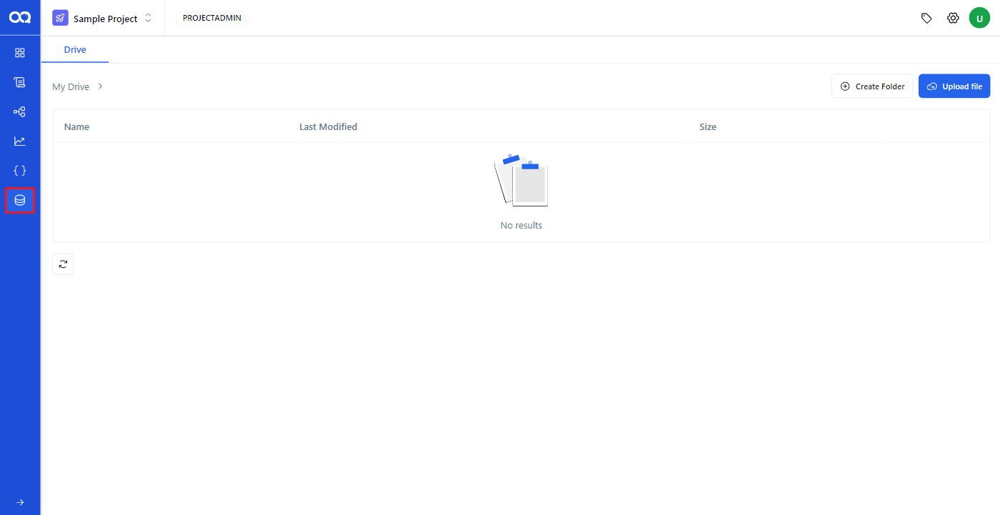

### 📤 Upload a File

To upload a file to Drive:

1. **Click on** [**Upload File**](#upload-file) 📤

   

2. **Click on the Upload File button**, then select the desired file.

   

   Optionally, assign a prefix to the file, though this is not mandatory.

3. **Click on** [**Upload**](#upload-file) 

   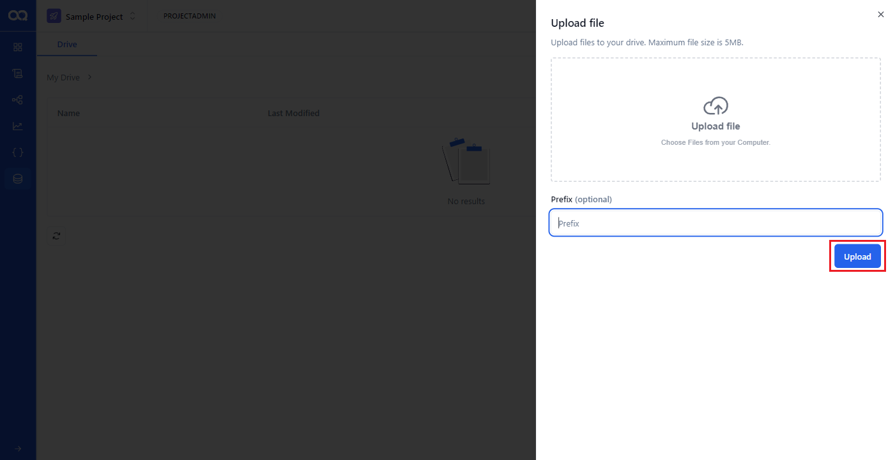

   The uploaded file will now appear in the list on the Drive page.

   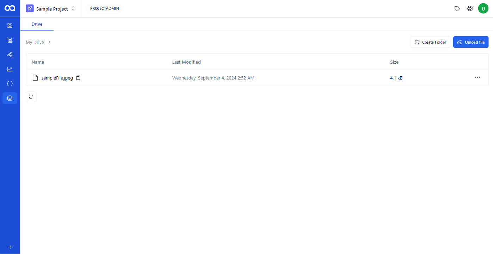

   You can **download** , **rename** , or **delete**  the uploaded file by clicking on the kebab menu.

   

### 📂 Create Folder

To create a folder:

1. **Click on** [**Create Folder**](#create-folder) 

   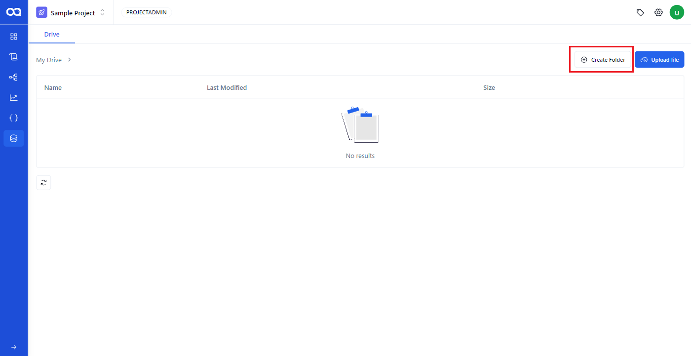

2. **Enter the desired folder name** in the dialog box that appears and click ‘Create’.

   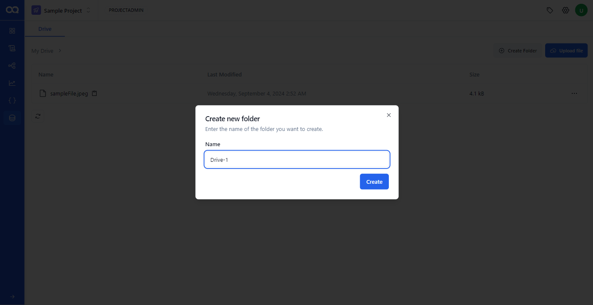

3. **Click on** [**Create**](#create-folder) 

   

   The newly created folder will be displayed on the Drive page.

   

   You can also **upload files**  and **create additional subfolders** inside the created folder.

   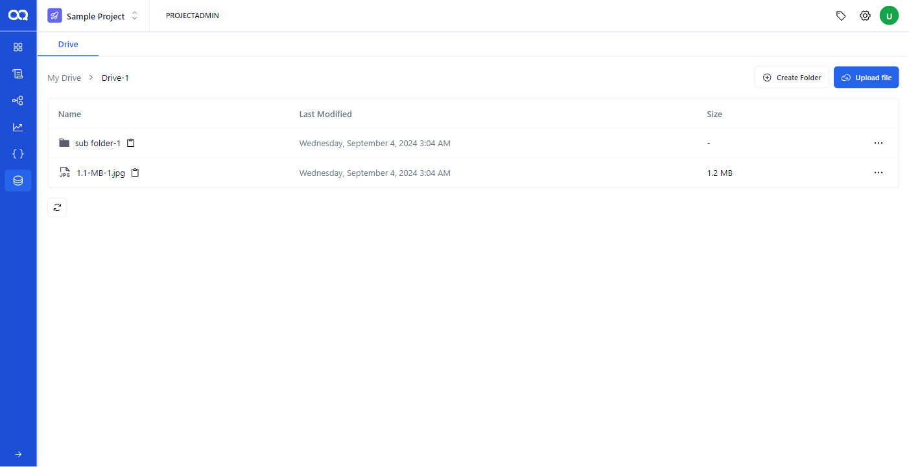

   User-created folders can be **renamed**  and **deleted**  by clicking on the kebab menu.

   

   Deleted files will disappear from the page.

   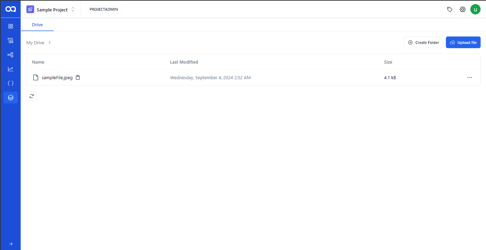

### 🗂️ Create Test Step for Downloading File

To use the 'DownloadFile' keyword:

1. **Create a new folder** on the Drive.

   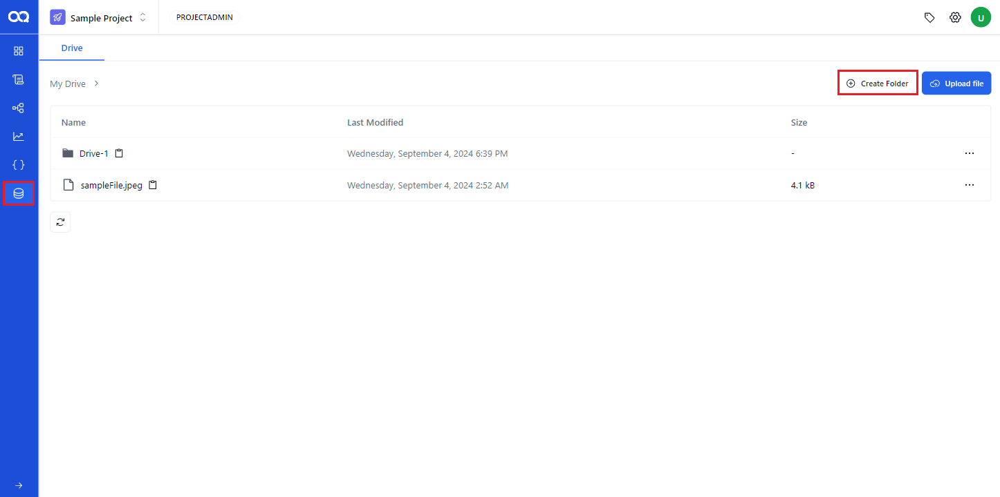

2. **Enter the folder name** ('Drive-2') and click ‘Save’.

   

3. The new folder will be listed on the Drive.

   

4. Go to the test case page and select **'Download File'** ⬇️.

   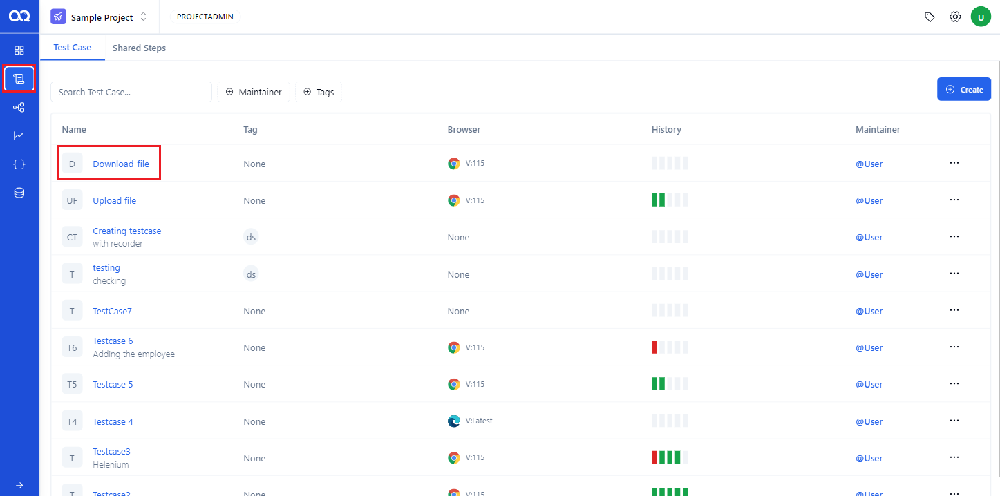

5. **Click the ‘Download File’ step**, enter the path including the new folder name ('Drive-2') and the file name, then click ‘Save’.

   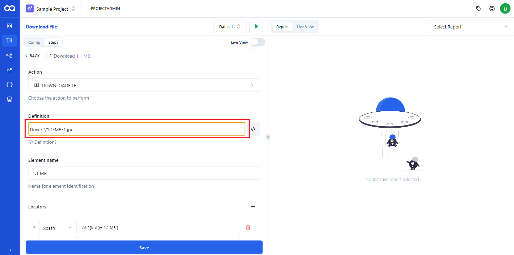

   Example Path: **'Drive-2/1.1-MB-1.jpg'**

6. **Click ‘Run’** 🏃‍♂️ to execute the test case and click the download button to download the file.

   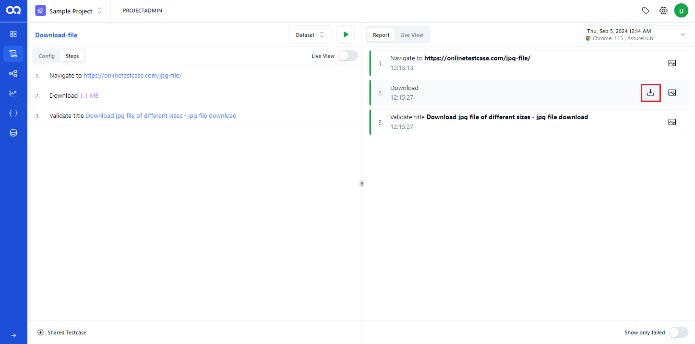

7. Return to the Drive page, and click on the **‘Drive-2’** folder to verify that the downloaded file is stored correctly.

   

   The downloaded file should be correctly stored in the ‘Drive-2’ folder.

   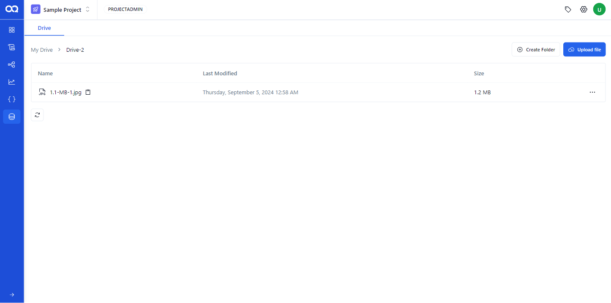

### 🗂️ Create Test Step for Uploading File

To use the 'UploadFile' keyword:

1. **Click on the 'Drive-1' folder** on the Drive page.

   

2. **Copy the file path** 📋 by clicking the button next to the name of the uploaded file.

   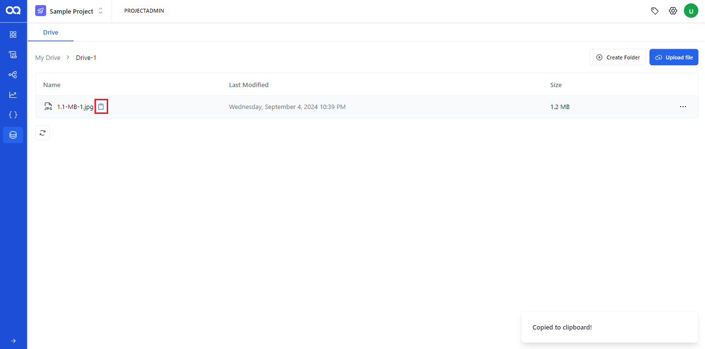

   The copied path will include the folder name preceding the file name.

   Example Path: **'Drive-1/1.1-MB-1.jpg'**

3. Go to the test case page and select **'Upload File'** 📤.

   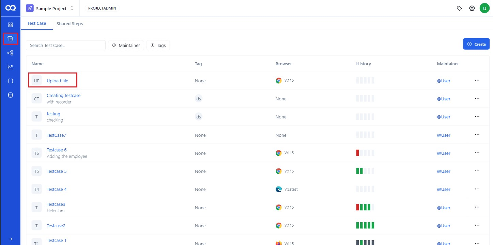

4. **Paste the copied path** into the definition field and click ‘Save’.

   

5. **Click ‘Run’** 🏃‍♂️ to execute the test case. The file present in the Drive will be uploaded to the application under test.

   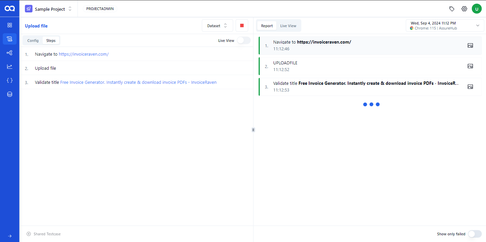
