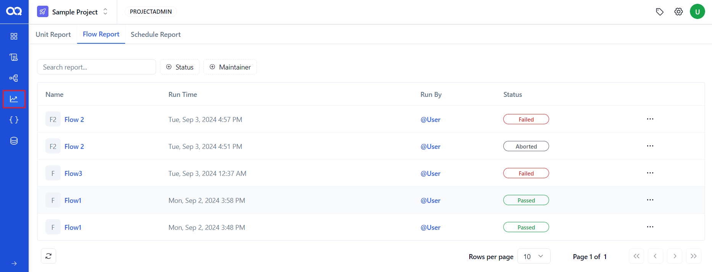
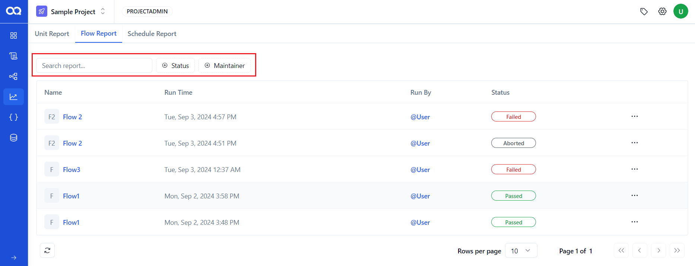
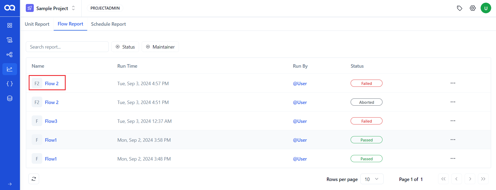
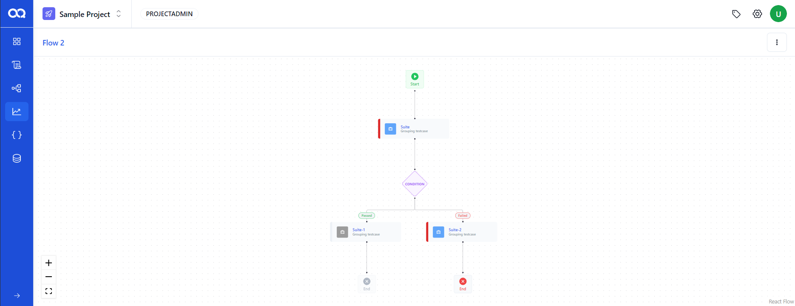
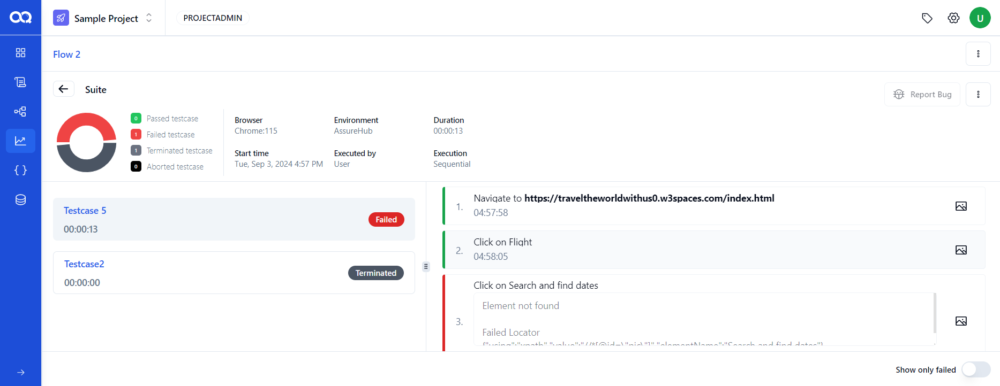
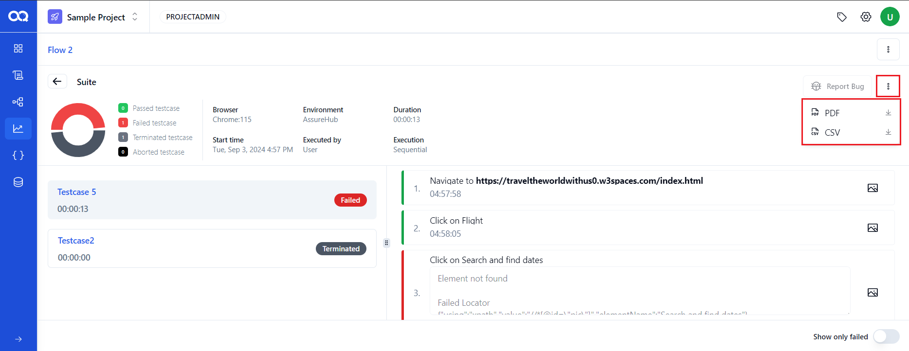
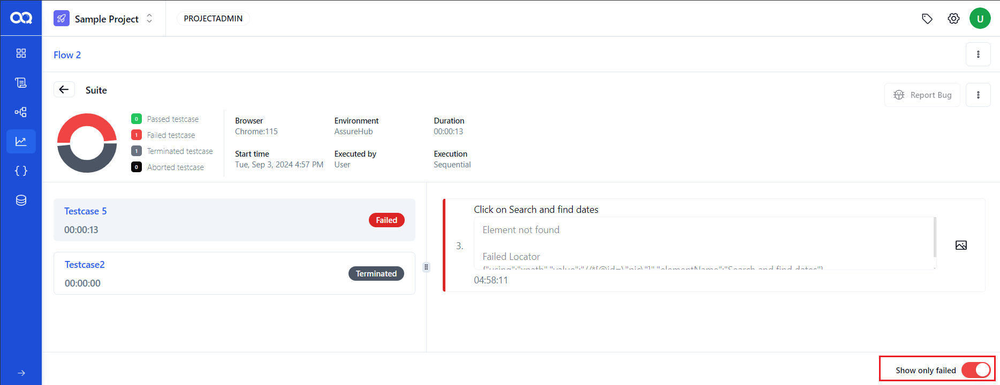

# 🚀 Overview of Flow Reports in AssureQA

Flow Reports in AssureQA provide a comprehensive look at the outcomes of your test flows, allowing for deep insights and effective management of your test results.

## 🛠️ Accessing Flow Reports

### Viewing Flow Reports

Each flow report on this page includes essential details such as the report's name, runtime, who ran the test, its status (passed, failed, or aborted), and available actions.

### Managing Reports

- **Delete Reports**: Utilize the action options by clicking the three dots next to a report to access and press the delete button if needed.

### Filtering and Searching

- **Filters**: You can filter reports by status (passed, failed, etc.) or maintainer for more precise viewing.
- **Search**: Look up specific reports by their names using the search field. Reset all filters with a simple click on the ‘reset’ button.

---

## 📊 Detailed Flow Report Analysis

To dive deeper into any flow report, follow these streamlined steps:

1. **Select a Report**:
   Choose the flow report you wish to examine for more detailed insights.

   

2. **View Detailed Structure**:
   The detailed report page shows the structure of the flow with each node highlighted based on its status.

   

3. **Suite Node Details**:
   Clicking on a suite node within the report will pull up a detailed summary. This includes a pie chart of statuses, and specifics like the browser used, start time, environment, and a list of test cases with their statuses.

   

4. **Download Reports**:
   Download a detailed PDF, CSV report, or screenshots of the flow by clicking the three dots in the report menu.

   

5. **Failure Details Toggle**:
   Enable the toggle to view details of failed test steps, enhancing your ability to analyze and address issues.

   

6. **Bug Reporting**:
   Report issues directly by clicking the option to report a bug, which is enabled once the user integrates their Jira account.

   

---

With these tools and insights, AssureQA makes it straightforward to manage, analyze, and act on the data from your flow tests, ensuring continuous improvement and effective bug tracking. 🌟 Explore these features to enhance your testing processes and outcomes!
