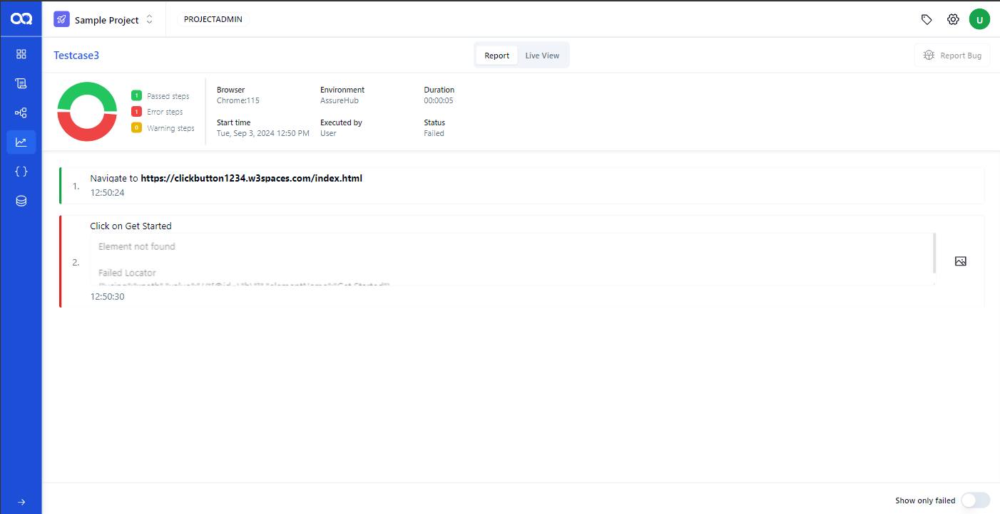

# 🚀 Navigating Unit Reports in AssureQA

Unit Reports provide detailed insights into individual test case executions, offering a granular view of test results and statuses. This guide helps you effectively use the Unit Reports page to monitor and analyze test outcomes.

## 🛠️ Accessing Unit Reports

### Overview of Reports

Explore detailed metrics for each test case, including names, run times, environments, and execution statuses.

### Enhanced Report Filtering

- **Filters**: Refine your view by status, environment, or tags to find specific test cases quickly.
- **Search**: Locate reports directly by name for faster access.
- **Navigation Controls**: Adjust how many reports you view per page, enhancing your browsing experience.

---

## 📊 Deep Dive into Detailed Reports

Gain comprehensive insights by exploring the specifics of each test case:

1. **Selecting a Report**:
   Click on a report to view an in-depth summary of that specific test execution.

   

2. **Detailed Analysis**:
   Review detailed data including a pie chart of test outcomes, browser used, start time, duration, and execution status.

3. **Failed Steps Visibility**:
   Toggle the view on the report page to specifically highlight and review any failed test steps, aiding in quick diagnostics and corrections.

   

4. **Direct Bug Reporting**:
   Report issues effectively by integrating your Jira account, enabling a seamless connection from test failures to bug tracking.

   

---

Utilize the Unit Reports page in AssureQA to maintain a close watch on test executions, ensuring that each unit is performing as expected and any issues are quickly addressed. 🌟 Tailor your reporting experience to suit your specific needs and drive efficient testing practices!
