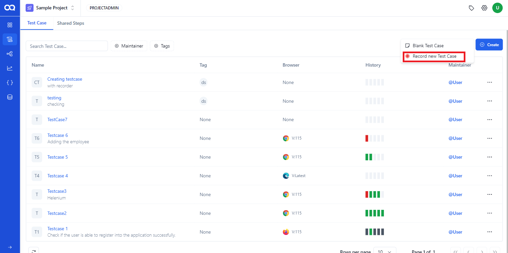

# 🚀 Creating a Test Case: 

Let's explore the process of creating a test case. You can either record a new test case or manually create one. Follow these steps for a smooth experience!

## 🛠️ Step 1: Navigating to the Test Case Page

To get started, head over to the test case page and click on *"Create"*. You’ll be given two options:
- *Record New Test Case*
- *Blank Test Case*

### 🎥 Recording a Test Case Using the Recorder

1. **Choose Your Option**:  
   If you'd like to record a script using the Recorder, select *"Record New Test Case"*. Prefer manual creation? Go with *"Blank Test Case"*. But let’s focus on recording a test case using the Recorder.

   

2. **Enter the URL**:  
   After choosing *"Record New Test Case"*, input the URL of the site you wish to record. Click the *Record* button and get ready to perform the actions.

   

3. **Perform Your Actions**:  
   Now, perform the actions you want to record, and the UI sensor will capture each one automatically.

4. **Stop Recording**:  
   When you’re done, hit the red *Stop* button to complete the recording.

   

5. **Save Your Test Case**:  
   Give your test case a suitable name and save it.

   

6. **Voila! Test Case Created**:  
   Your recorded test case is now saved in your account, ready to be executed.

   

---

### 📝 Creating a Blank Test Case

Prefer to create your test manually? No problem!

1. **Select Blank Test**:  
   Choose the *"Blank Test Case"* option to manually input test steps. You’ll be prompted to enter the test case name, description, and a valid URL.

   

2. **Configure the Environment**:  
   After confirming the environment and browser settings, click *Create* to finalize your new test case.

3. **Add Your Test Steps**:  
   Ready to define your actions? Hit the *"Add"* button to incorporate the steps.

   

4. **Step Successfully Added**:  
   Input the details of each step, and you’re good to go!

   

---

Now you're all set to create both recorded and manual test cases with ease! 🎉  
Feel free to explore and make your testing even more efficient.