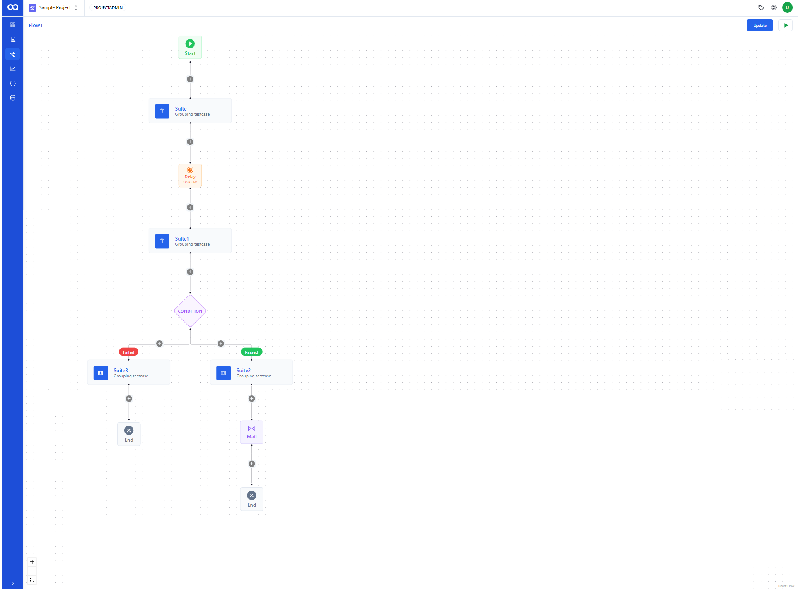

# 🚀 Running a Flow with Multiple Nodes in AssureQA

Running a flow with multiple nodes in AssureQA allows for a comprehensive and efficient testing process. This guide explains how to execute a flow that incorporates various node types, ensuring a structured and orderly test execution.

## 🛠️ Steps to Execute a Multi-Node Flow

### Running the Flow

1. **Start the Execution**:
   Begin by clicking the *Run* button to start the flow. This action triggers the sequential execution of nodes configured within your flow.

   

2. **Monitoring the Flow**:
   Once started, you’ll be redirected to the flow report page. This page dynamically updates as each node progresses. Initially, the first suite node will be active, while subsequent nodes wait in a frozen state.

   

3. **Delay and Continuation**:
   After the completion of the first node, a delay node may pause the execution for a specified period before continuing to the next suite node.

   

4. **Conditional Execution and Notifications**:
   Depending on the outcome of the second suite node, a conditional execution node will trigger subsequent nodes. If configured, a mail node sends out the flow’s report to designated recipients. The execution completes when the exit node is reached.

   

---

### Important Considerations

- **Error Handling**: If the first suite node fails, subsequent nodes will not execute, and their status will be marked as failed. This ensures that no unnecessary actions are taken if a critical part of the flow fails.

- **Notifications**: In flows containing both suite and mail nodes, if the suite node fails, the mail node remains responsible for sending out the flow’s report, ensuring that all stakeholders are informed of the test outcomes.

---

By following these steps, you can effectively run and manage multi-node flows in AssureQA, optimizing your testing processes and ensuring thorough coverage of your test scenarios. Dive in and harness the power of structured node-based testing! 🌟
