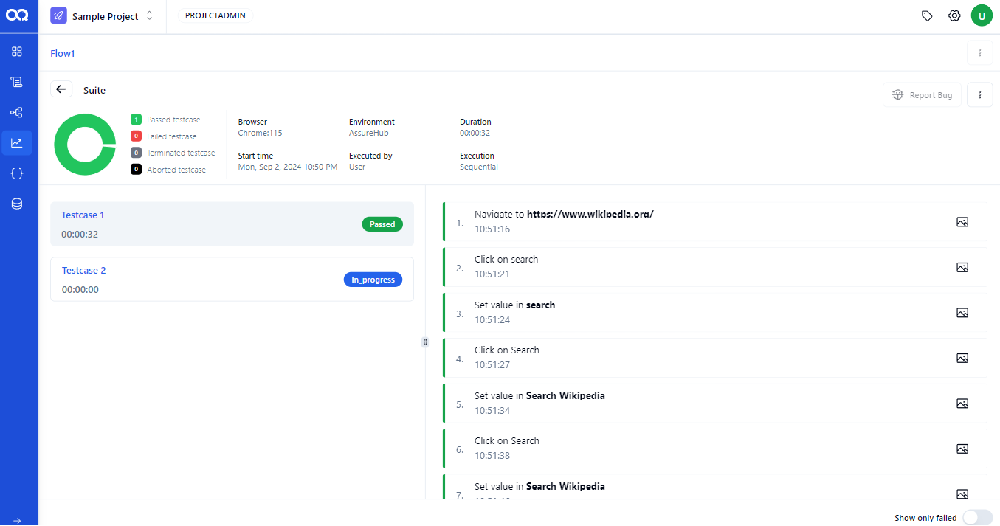
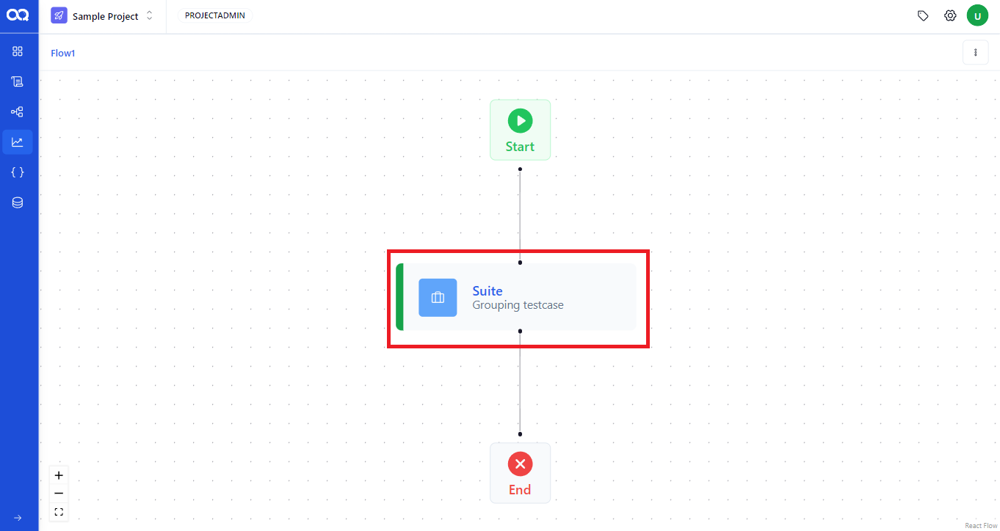

# 🚀 Understanding Flow Execution Modes in AssureQA

In AssureQA, you can manage your test flows using different execution modes to optimize testing efficiency. This guide will explain how to execute flows in both serial and parallel modes.

## 🛠️ Setting Up Flow Execution

Choose the mode that best fits your testing needs—whether it’s running tests sequentially (Serial Mode) or simultaneously (Parallel Mode).

### Serial Mode: Sequential Execution

1. **Initiate Execution**:
   Start the execution by clicking the *Run* button in the flow builder interface.

   

2. **Monitoring Progress**:
   After initiation, you'll be redirected to the flow report page where you can track the progress of each suite node.

   

3. **View Live Reports**:
   Click on any suite node to view a live report, observing the test cases as they run one after the other.

   

4. **Completion Status**:
   Each node will update from "InProgress" to "Passed" or "Failed," with the node color changing to green for passed and red for failed.

   

---

### Parallel Mode: Concurrent Execution

1. **Start Parallel Execution**:
   Execute the flow in parallel by hitting the *Run* button, similar to the serial mode, but here multiple test cases run at the same time.

   

2. **Observe Multiple Nodes**:
   The flow builder will show the status of each suite node simultaneously on the flow report page.

   

3. **Finalizing Tests**:
   The test cases within each suite complete their execution concurrently, updating the status from "InProgress" to "Passed" or "Failed".

   

---

These execution modes provide flexibility and control over how your test cases are run, ensuring that you can optimize your testing process according to project requirements and timelines in AssureQA. 🌟 Dive in and choose the mode that best suits your testing strategy!
