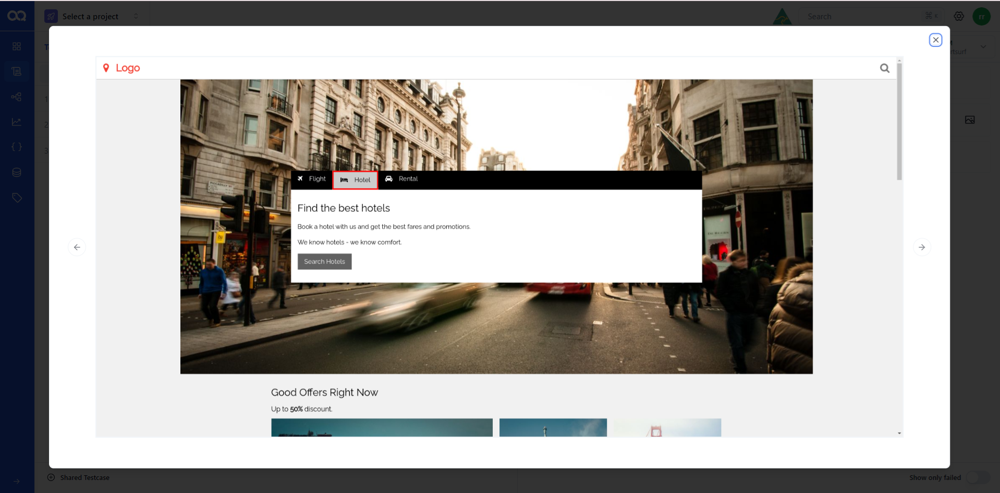

# 🤖 AI-Powered Testing

AssureQA leverages AI technology to enhance the reliability and resilience of test execution, making your test scripts more adaptive to UI changes. The AI operates using two powerful methods that work in tandem:

- **Character Recognition**
- **Script Healing**

These capabilities ensure that your tests can dynamically adapt to unexpected changes in the UI, reducing the need for manual intervention and script updates.

---

## 🔍 Character Recognition Method

The **Character Recognition** method is a fallback mechanism that allows AssureQA’s AI to identify elements based on their visible name on the screen. Here’s how it works:

1. **Input Element Name**: 
   - The user provides the **correct element name** in the **Element Name** field.

2. **Fallback Mechanism**: 
   - If traditional methods like XPath or CSS selectors fail, the AI switches to character recognition, scanning the screen to locate the element based on its visible name.

3. **Perform Action**: 
   - Once the element is identified, the AI executes the action on that element.

> [!TIP]
> Providing an accurate element name is key to ensuring the AI can find and interact with the correct element.

---

## 🔄 Script Healing: Adaptive Testing

The **Script Healing** feature of AssureQA complements the Character Recognition method by automatically adapting to changes in UI elements, ensuring that your test cases continue to work even when locators change.

### How Script Healing Works Together with Character Recognition

Imagine you have a dynamic application where UI elements, like buttons or fields, change frequently. Initially, your test case might interact with a button using a locator such as `id="hotel1"`. Over time, this locator changes to `id="hotel2"`. Normally, this would break the test, but with script healing enabled, AssureQA adapts and finds the new locator without manual updates.

### Steps to Enable Script Healing in a Test Case:

1. **Record the Test**:
   - Begin by recording actions on the site, such as clicking a "Hotels" button.

   

2. **Save the Test Case**:
   - After recording, save the test case for future execution.

   

3. **Enable Script Healing**:
   - On the test case page, open the **Config** settings and enable the **Self Healing** option.

   

4. **Execute the Test**:
   - Run the test case. During the first execution, the test should pass as expected with the original locator.

   

### What Happens When Locators Change?

If the button’s locator changes from `id="hotel1"` to `id="hotel2"`, simply rerun the test without updating the locator manually. The **Script Healing** feature will automatically detect the new locator and execute the test successfully.

   

### Visual Confirmation of Script Healing

When script healing occurs, AssureQA visually marks the healed element with a **red rectangular box** in the screenshot, indicating that the AI has dynamically adjusted to the change.

   

---

## 🎯 Why AssureQA’s AI Makes Your Tests More Reliable

By combining **Character Recognition** and **Script Healing**, AssureQA creates a robust, adaptive testing environment that:

- **Reduces Manual Updates**: Automatically adapts to UI changes without the need to constantly update test scripts.
- **Ensures Resilience**: Even if locators change or traditional identification methods fail, your tests continue to run smoothly.
- **Improves Test Maintenance**: With less manual intervention required, you can focus on expanding test coverage instead of maintaining existing tests.

With these AI-driven features, AssureQA ensures that your tests remain stable, even in the face of frequent UI changes, making your automation smarter and more resilient.
