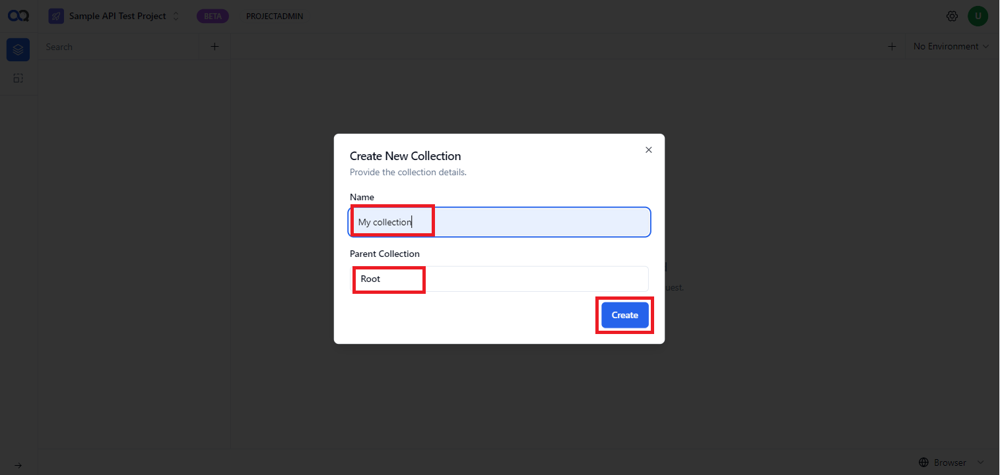

AssureQA enables you to create, execute, and manage API tests, specifically supporting RESTful API testing. RESTful APIs provide access to resources using standardized methods and protocols, simplifying the development and maintenance of applications.

---

## 📂 Collection Management

### **Creating a Collection**

1. Click on the '**+**' button.
2. Select **New Collection**.

   

3. Enter the collection name and select the parent folder.
4. Click **Create**.

   

Created collections will be displayed on the left-hand side.

   

### **Renaming a Collection**

1. Click on the **kebab menu** next to the collection.
2. Select **Rename**.

   

3. Enter the new name in the **Name** field.
4. Click **Update**.

   

### **Creating a Sub-collection**

1. Click on the **kebab menu** next to the collection.
2. Select **New Collection**.

   

3. Enter the collection name and select the parent folder.
4. Click **Create**.

### **Deleting a Collection**

1. Click on the **kebab menu** next to the collection.
2. Select **Delete**.

   

3. Click **Delete** in the confirmation dialog box.

   

