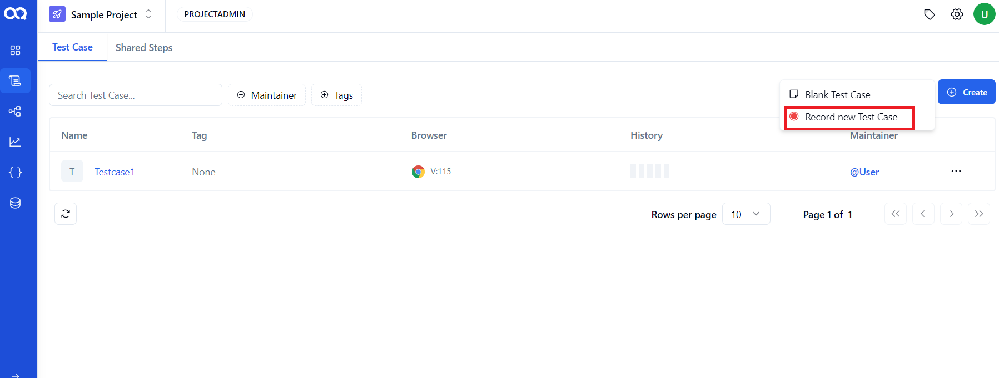
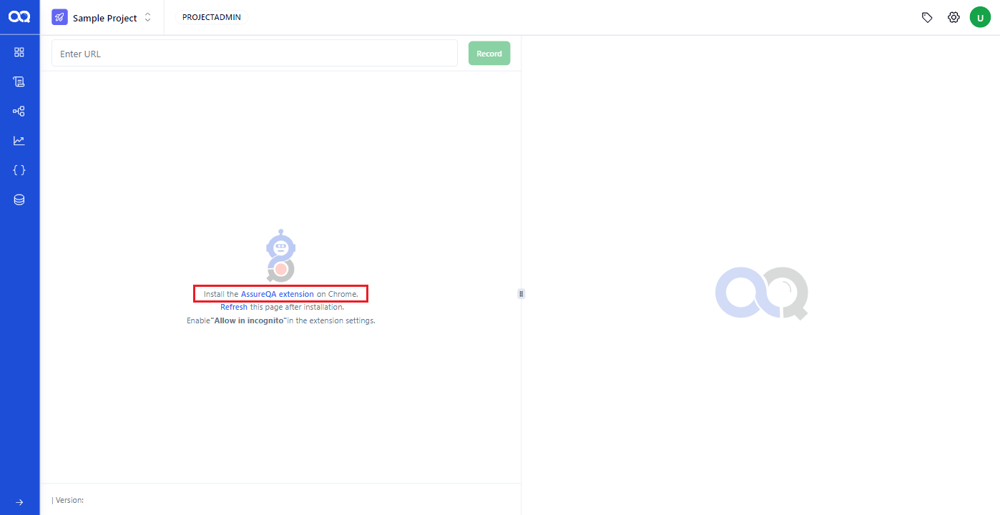
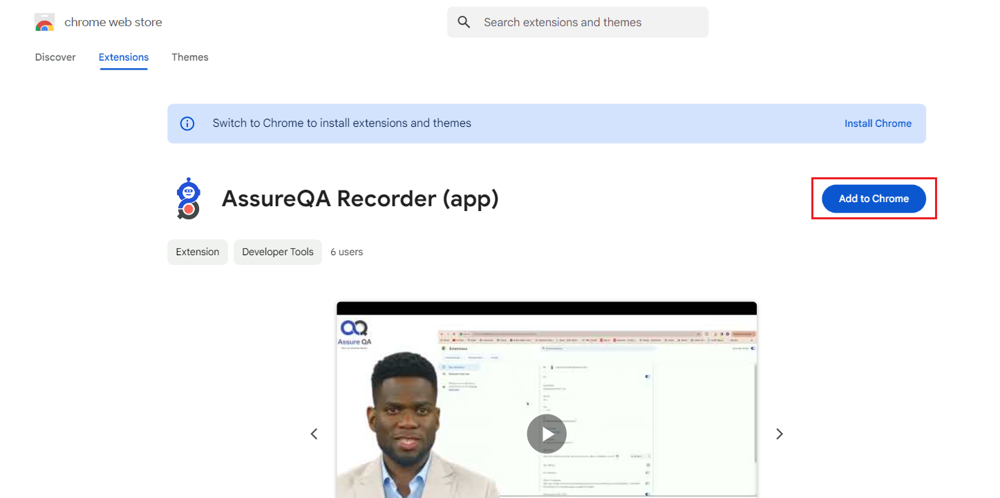
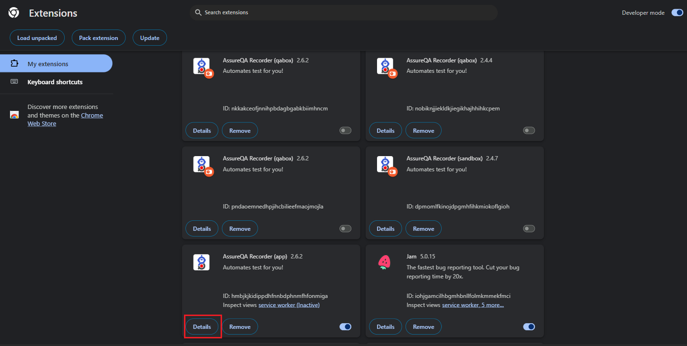
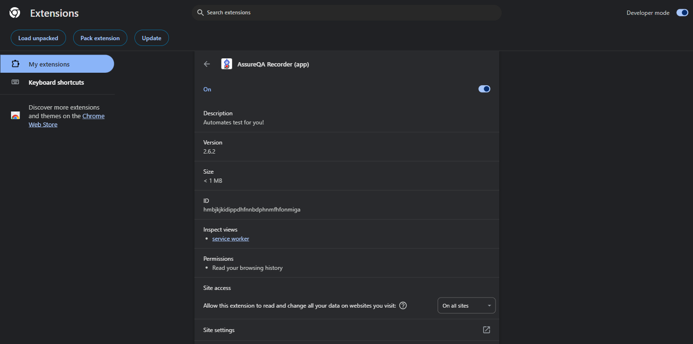
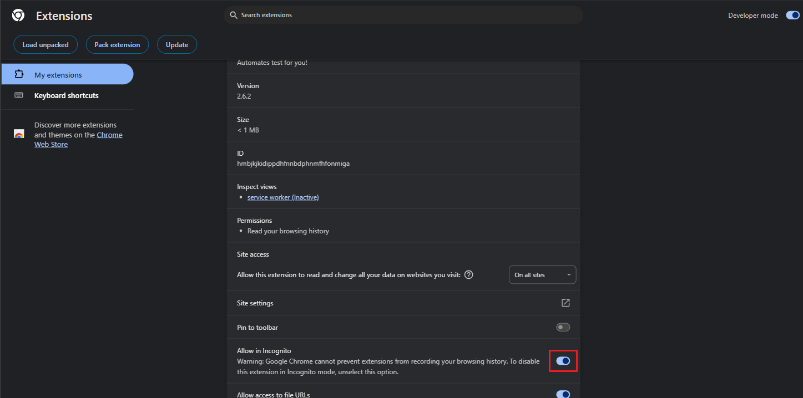
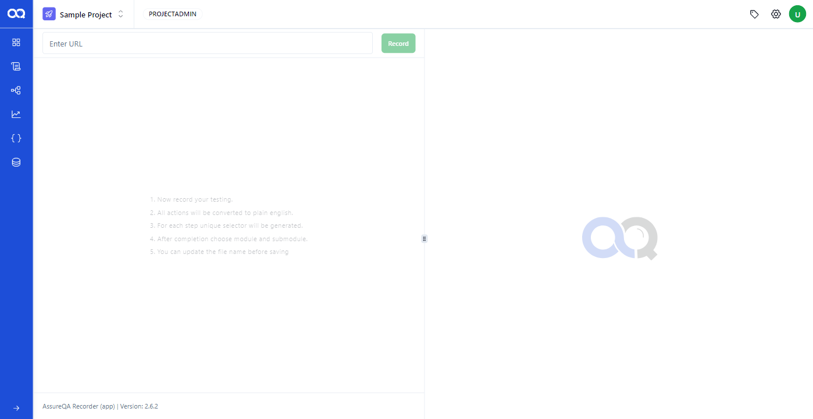

To capture test events, AssureQA requires the installation of its Chrome extension, known as the **Recorder**. This extension allows users to record test cases directly from their browser. Follow these steps to install the UI sensor and get started with your test recordings.

## 📥 Installing the AssureQA Recorder

1. **Start Recording a Test Case**:
   - Click on the **Record new testcase** button to open the recording page.

   

2. **Install the Chrome Extension**:
   - On the recording page, click the **Install AssureQA Extension on Chrome** option. This will navigate you directly to the Chrome Web Store.

   

3. **Add Extension to Chrome**:
   - In the Chrome Web Store, click the **Add to Chrome** button to install the extension.

   

---

## 🔧 Configuring the Extension

After installing the Recorder, you’ll need to configure a few settings to ensure it works correctly for your tests.

1. **Manage Extension Settings**:
   - Once installed, go to your Chrome extension settings by clicking on the **Manage Settings** button, and then select **Details**.

   

2. **Enable Incognito Mode**:
   - Make sure that **Incognito mode** is enabled to prevent any cached data from affecting your tests. You can enable this in the extension settings under the **Allow in Incognito** section.

   
   

---

## 🚀 Start Recording Test Cases

Once the Recorder is installed and configured, you’re ready to start recording your test cases using AssureQA's built-in recorder.

   

---

