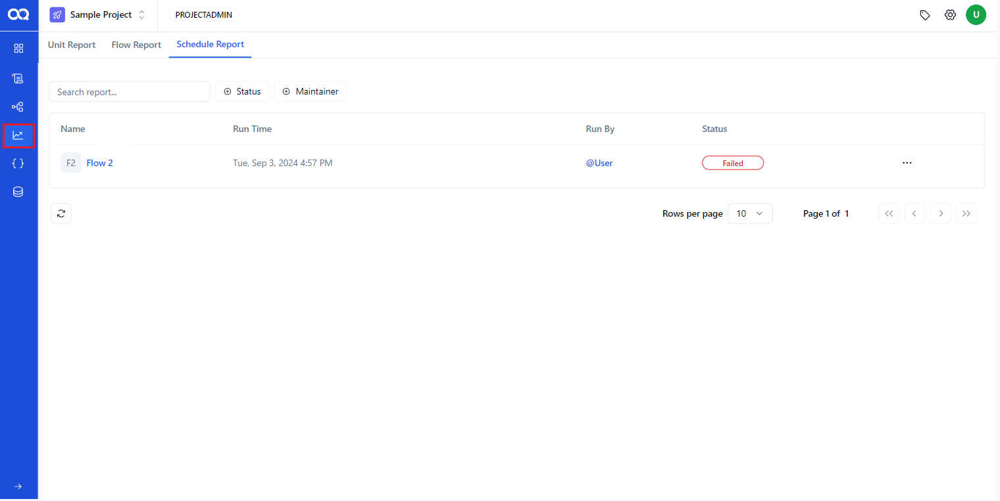
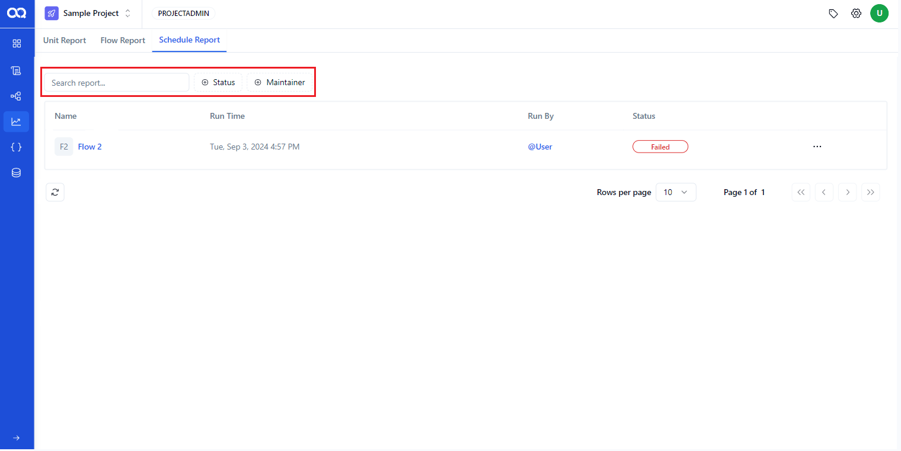
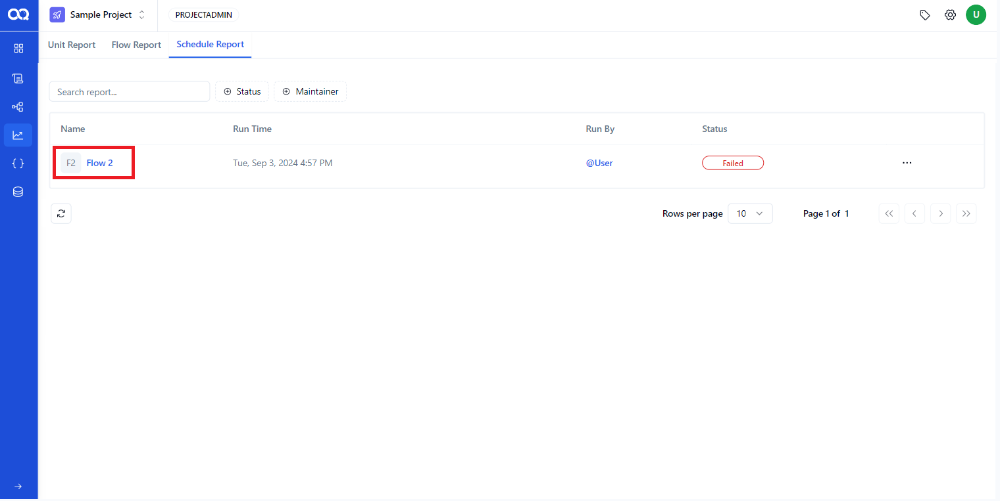
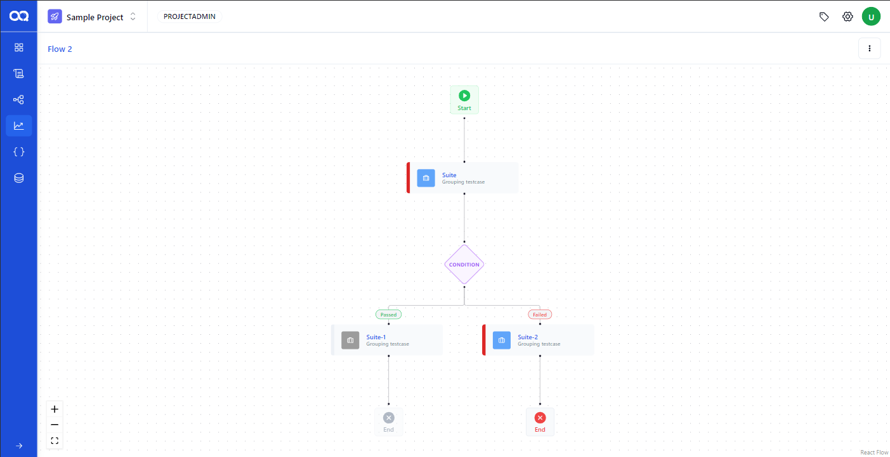
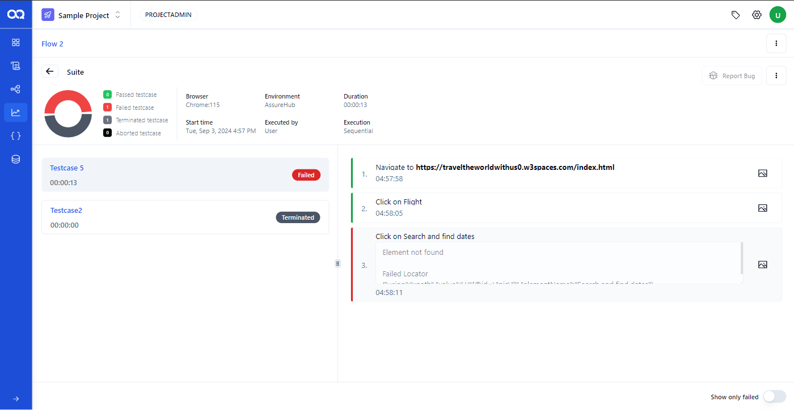
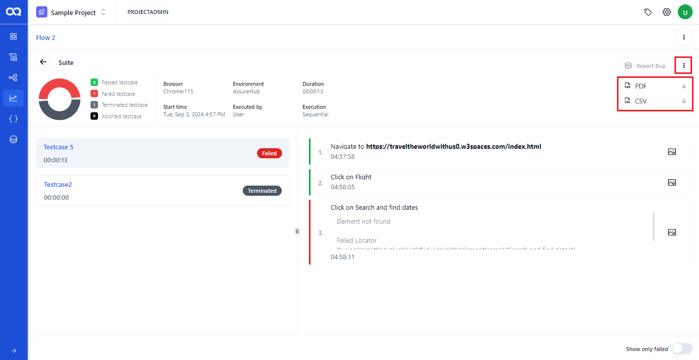
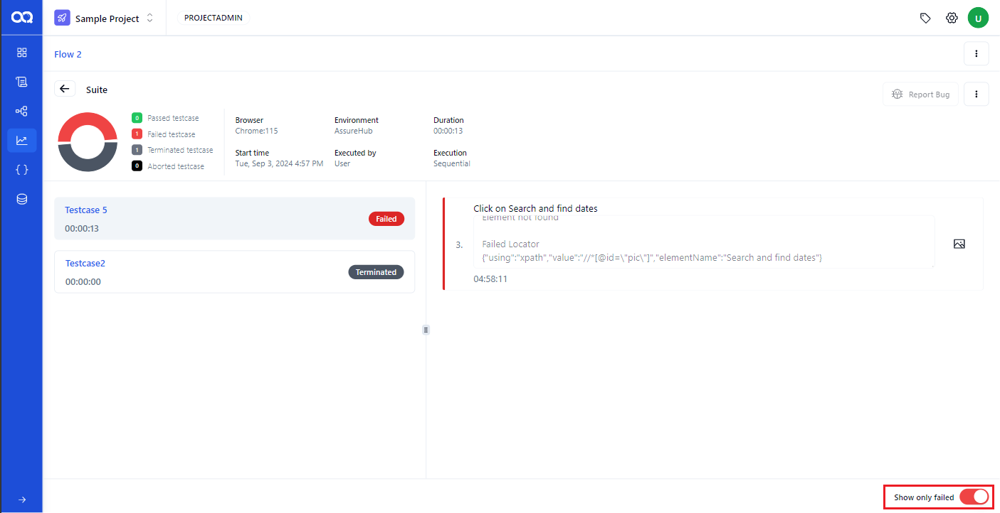
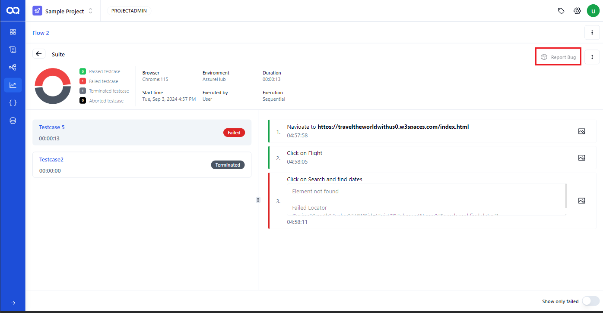
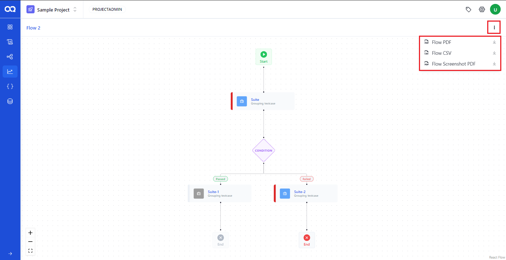

Schedule Reports in AssureQA allow teams to track and analyze scheduled test executions over time. This guide provides a clear pathway to navigating and utilizing schedule reports effectively.

## 🛠️ Exploring Schedule Reports

### Accessing Schedule Reports

Discover all your scheduled test executions on this page, complete with comprehensive details:

- **Report Overview**: View names, run times, statuses, and more for each scheduled report.

- **Actions**: Utilize options to manage reports, including deleting unnecessary ones directly from the interface.

### Advanced Filtering and Quick Search

- **Filters**: Narrow down reports by status (e.g., passed, failed), frequency (daily, weekly, monthly), or maintainer.
- **Search**: Quickly find specific reports by name.
- **Reset**: Clear all filters with one click to refresh your view.

---

## 📊 Detailed Analysis of Schedule Reports

Dive deeper into any schedule report to extract more nuanced insights:

1. **Selecting a Report**:
   Begin by choosing a schedule report you wish to analyze further.

   

2. **Detailed Report View**:
   Gain insights into the structured flow of tests, with nodes highlighted according to their execution status.

   

3. **Suite Node Analysis**:
   Explore detailed summaries by clicking on suite nodes, featuring pie charts and execution specifics such as browsers used, environment details, and individual test statuses.

   

4. **Downloading Reports**:
   Obtain detailed PDFs or CSVs of the reports for offline analysis and archiving by clicking the download option.

   

5. **Failed Steps Visibility**:
   Toggle the view to highlight failed test steps, enabling focused troubleshooting and bug fixing.

   

6. **Bug Reporting**:
   Report bugs directly through the system by integrating your Jira account, enhancing the feedback loop for development teams.

   

7. **Comprehensive Downloads**:
   Access complete test documentation including PDFs, CSVs, and screenshot compilations for comprehensive review.

   

---

Leverage these features to maintain a robust oversight of scheduled tests, ensuring your team stays informed and proactive in handling test outcomes. 🌟 Harness the full potential of schedule reports in AssureQA to streamline your testing operations!
