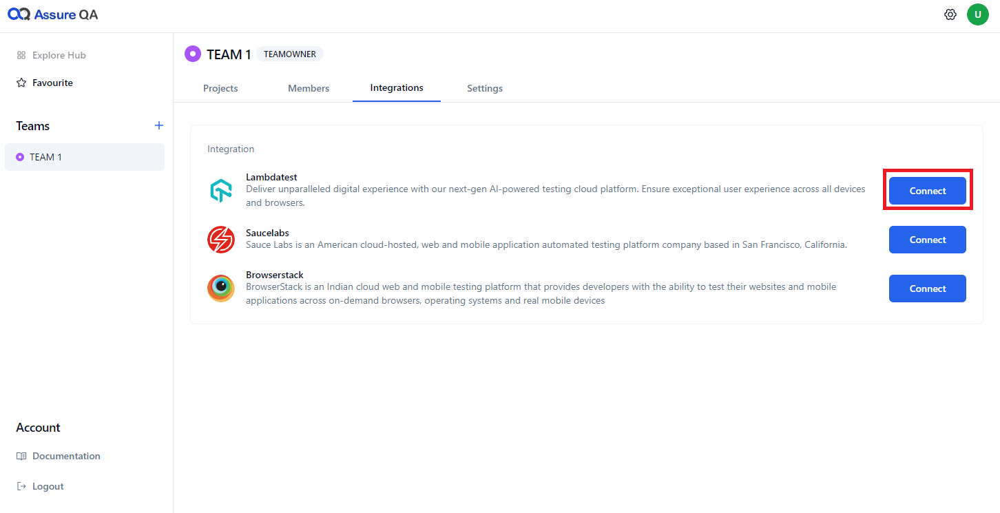
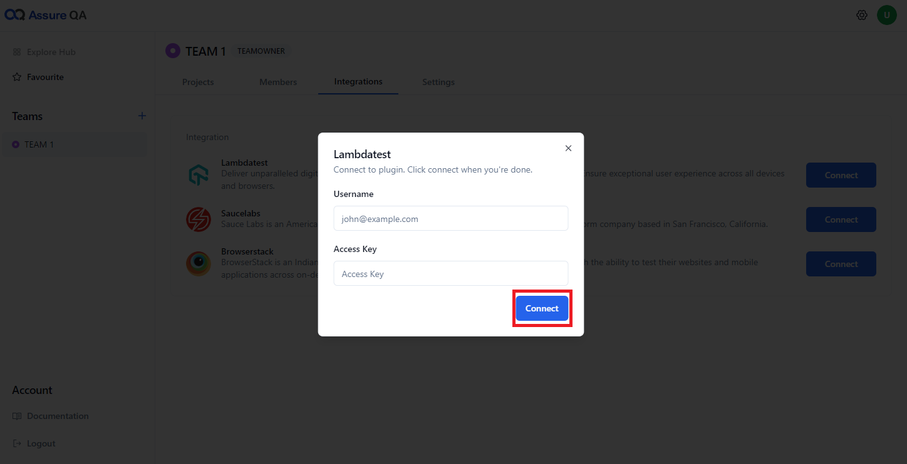
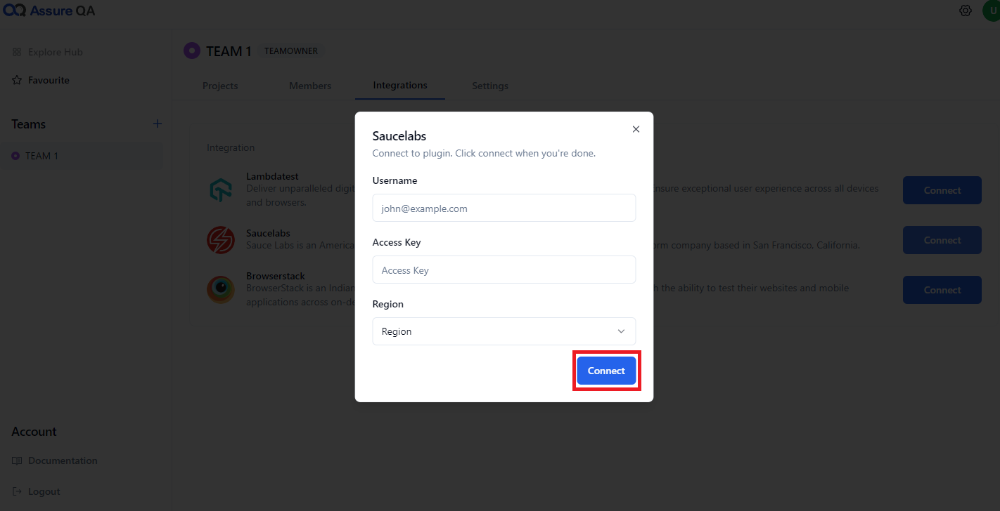
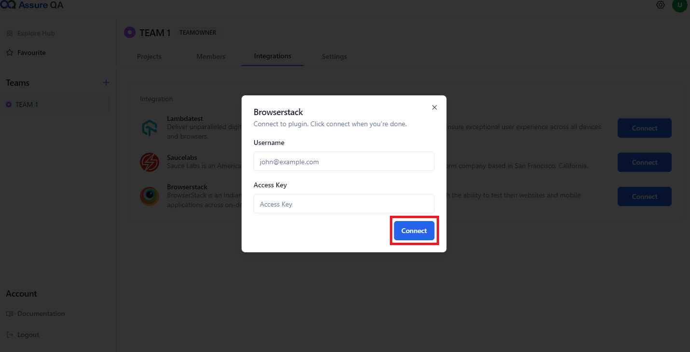

AssureQA makes it super easy to integrate with third-party services like **BrowserStack**, **LambdaTest**, and **SauceLabs** and many more. Once integrated, all team members can access these services seamlessly. Let’s see how to set it all up!

## 🛠️ Step-by-Step Integration

### 💠 LambdaTest Integration

1. **Click "Connect"**:  
   Start by clicking the **"Connect"** button next to LambdaTest.

   

2. **Input Credentials**:  
   Enter your **username** and **access key**, then click **Connect**.

   

---

### ⚡ SauceLabs Integration

1. **Click "Connect"**:  
   Begin by selecting **"Connect"** next to SauceLabs.

2. **Enter Credentials**:  
   Input your **username**, **access key**, and choose a **region**. Click **Connect**.

   

---

### 🌐 BrowserStack Integration

1. **Click "Connect"**:  
   Select the **"Connect"** button next to BrowserStack.

2. **Enter Credentials**:  
   Provide your **username** and **access key**, then hit **Connect**.

   

---

> [!Note]
> For all third-party integrations, you just need the **username** and **access key**.
