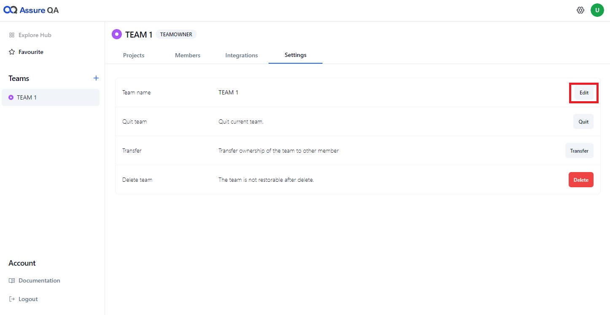
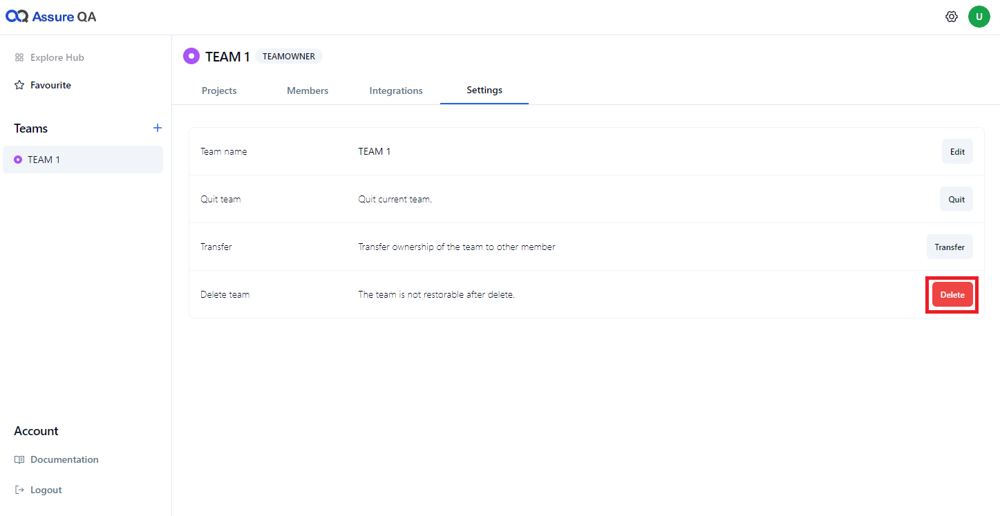

AssureQA allows team owners and administrators to manage their teams effectively. Below you’ll find various actions you can perform to manage your team settings.

## 🛠️ Step-by-Step Management

### 🏷️ Edit the Team

1. **Click "Edit"**:  
   Start by clicking the **"Edit"** button to modify your team name.

   

2. **Update Team Info**:  
   Enter the new team name and confirm your changes.

---

### 🚪 Quit the Team

1. **Click "Quit"**:  
   To leave a team, click the **"Quit"** button.

   

2. **Confirm Quit**:  
   Confirm your decision. Remember, Quiting the team means you will lose access to all projects associated with it.

> [!NOTE]
> If you are the team owner, ensure to transfer ownership before leaving.

---

### 🔑 Transfer the Team

1. **Click "Transfer"**:  
   Click on **"Transfer"** button within the team settings.

   

2. **Select Member**:  
   Choose a team member to transfer ownership to and confirm.

---

### 🗑️ Delete the Team

1. **Click "Delete"**:  
   Navigate to the team settings and click on **"Delete"**.

   

2. **Confirm Deletion**:  
   Confirm the deletion. Keep in mind, this action is irreversible and will delete all projects associated with the team.

---

> [!NOTE]  
> Manage your team wisely. Changes like deleting the team or transferring ownership are significant and should be handled carefully.
