AssureQA allows you to manage teams, create projects, and collaborate seamlessly. Whether you’re the **team owner** or a **team member**, this guide will walk you through everything you need to know!

## 🚀 How to Build a Team?

1. **Create a Team**:  
   Click the **"Build Your Team"** button to begin.

   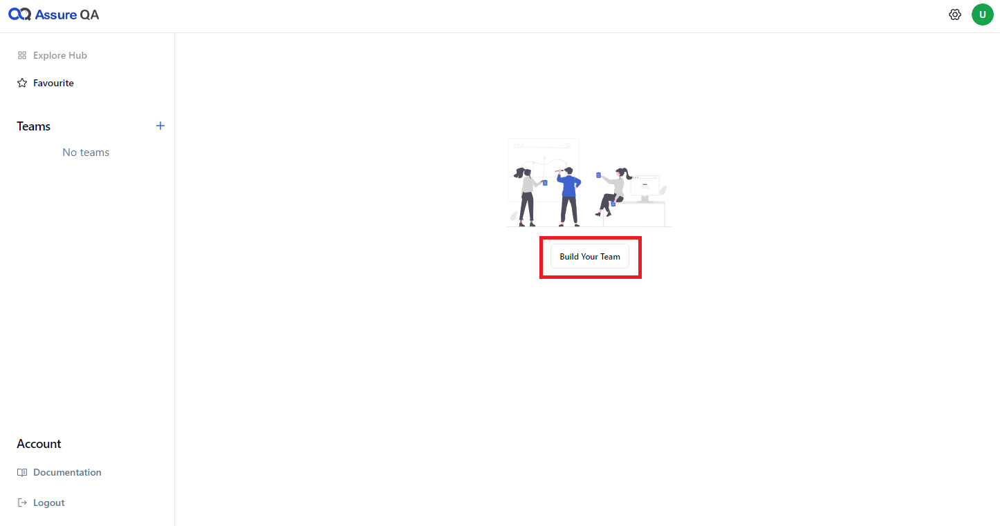

2. **Name Your Team**:  
   Enter the **team name** and click **Create**. The person creating the team becomes the **team owner**.

   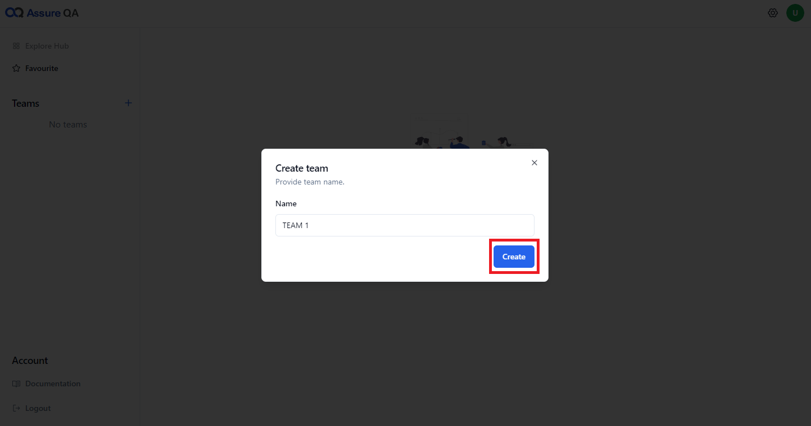

💡 **Note**:  
Anyone Signed up on AssureQA can create a team.

---

### 🌟 Project Creation

Projects in AssureQA act as independent workspaces for **web automation** or **API testing**. Here's how you can create one:

1. **Click "Add Project"**:  
   Hit the **Add Project** button.

2. **Enter Project Details**:  
   Name your project, choose the type (web automation or API testing), and click **Create**.

   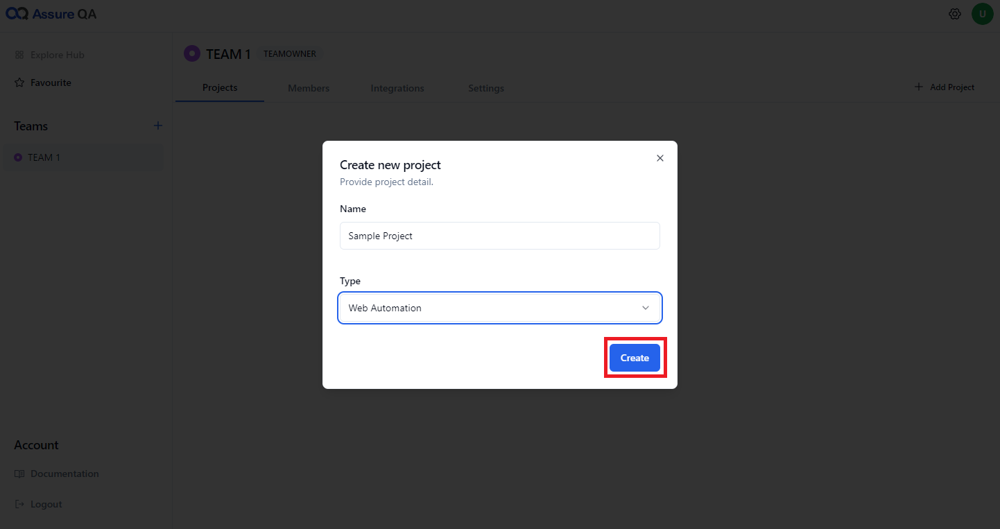

---

### ✉️ Inviting Team Members

1. **Click "Invite"**:  
   Head over to the **Invite** button.

   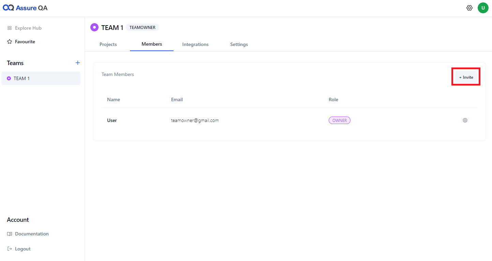

2. **Enter Email & Assign Role**:  
   Input the member's **email**, select their **role** (e.g., Project Admin, Editor, Reader), and send the invite.

   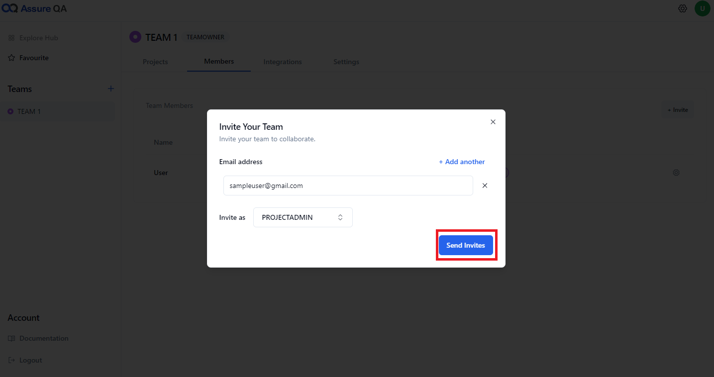

💡 **Note**:  
Only the **team owner** and **team admin** can invite new members.

---

### ⚙️ Managing Team Roles

1. **Change Team Roles**:  
   Click the icon next to the member’s name to assign them a new role (Team Admin or Team Member).

   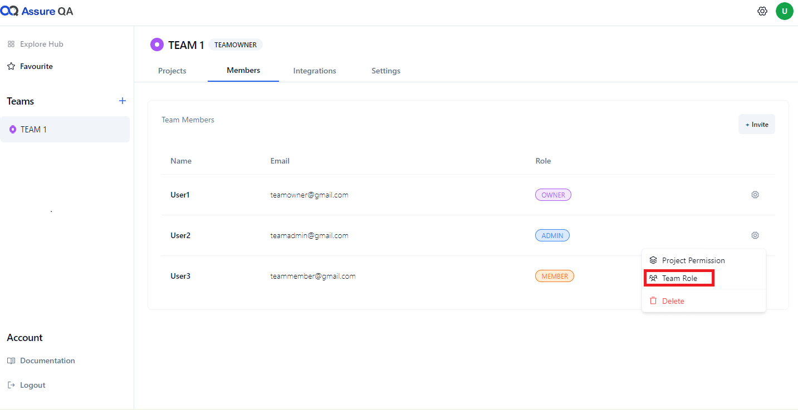

2. **Update Role**:  
   Select the desired role and click **Update**.

   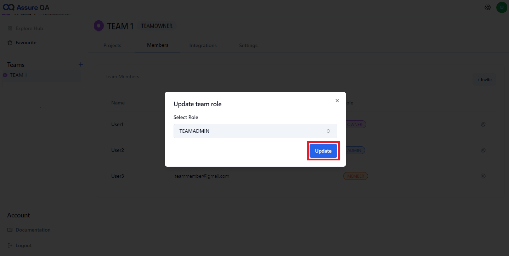

---

### 🚫 Removing Team Members

1. **Click the Delete Icon**:  
   Next to the member’s name, click the delete icon.

   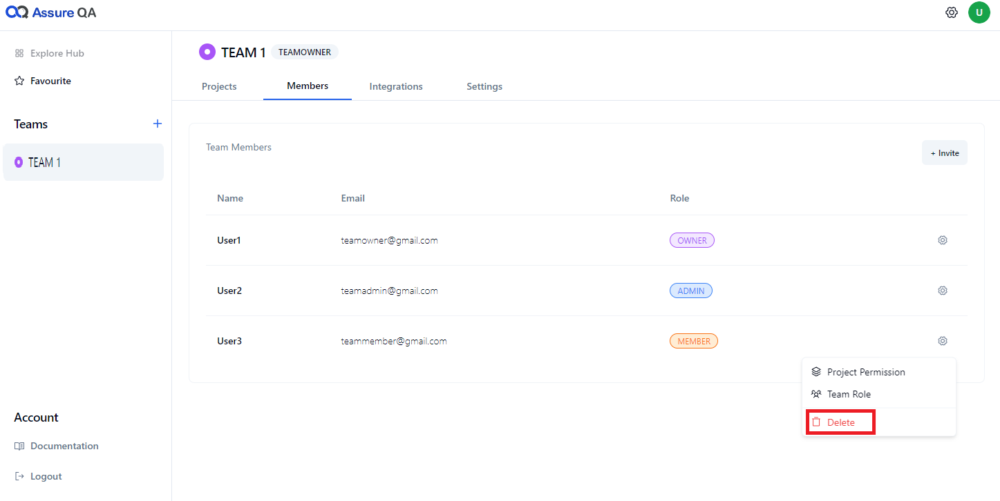

2. **Confirm Deletion**:  
   Confirm by clicking the **Delete** button.

   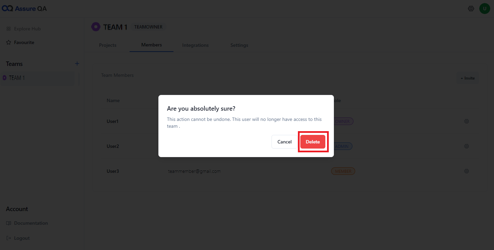

💡 **Note**:  
Only **team owners** and **admins** can remove members.

---

### 🔒 Project Permissions

1. **Access Project Permissions**:  
   Click the icon next to the member’s name and choose **Project Permissions**.

   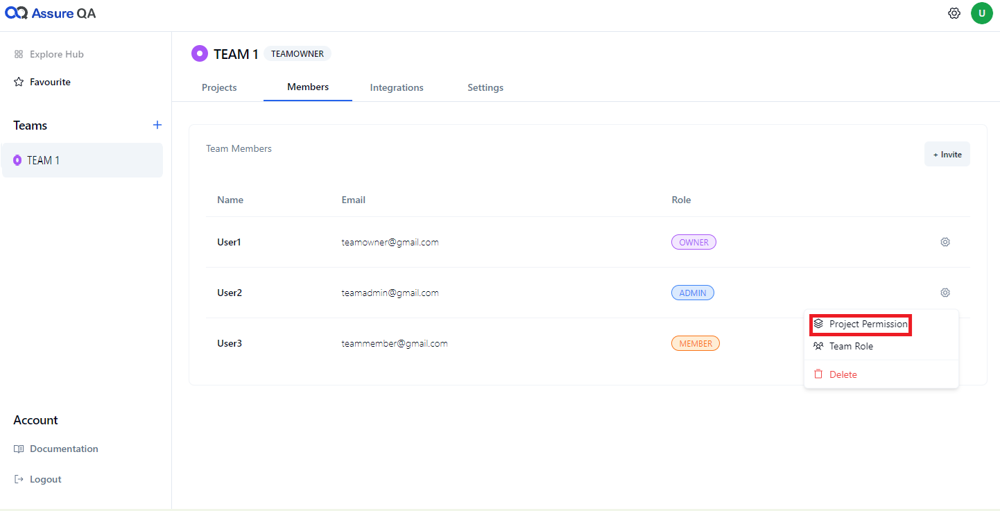

2. **Set Permissions**:  
   Select the appropriate permission level from the dropdown menu and hit **Update**.

   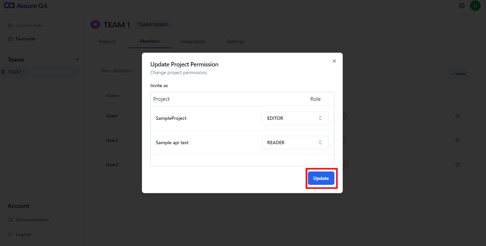

💡 **Note**:  
Only **team owners** and **project admins** can modify permissions.

---
