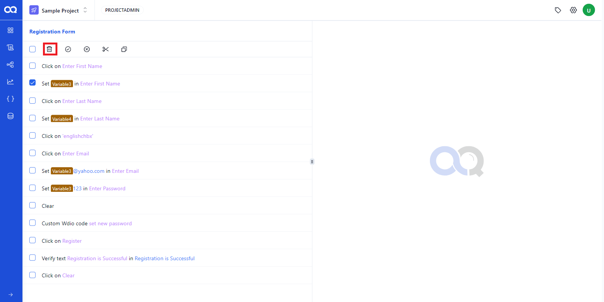
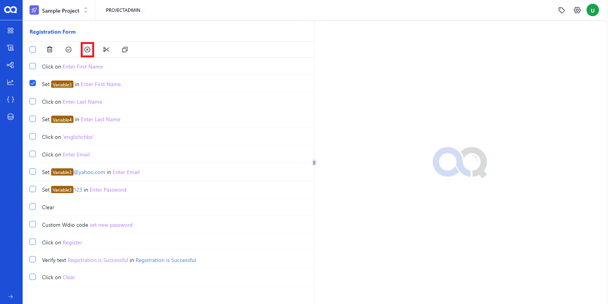
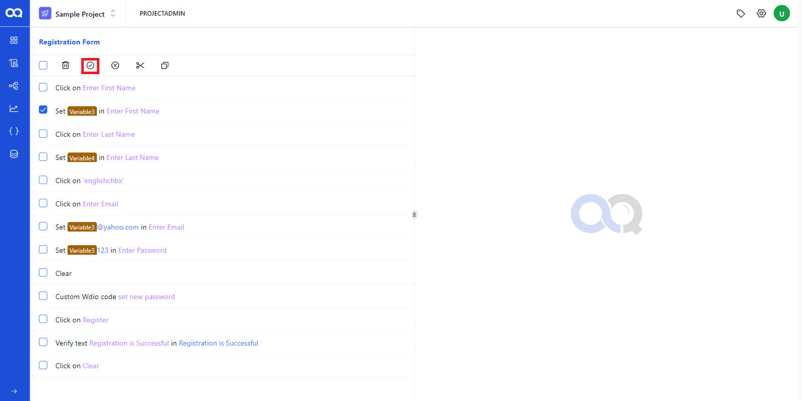
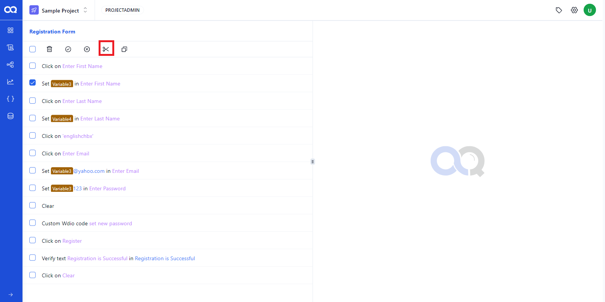
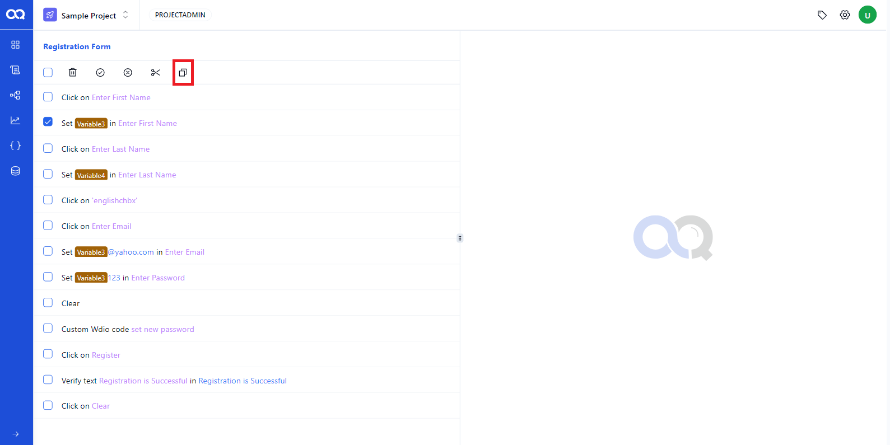

Editing shared steps in AssureQA offers flexibility by allowing users to modify, delete, enable, disable, or rearrange test steps. This guide provides a detailed overview of the available edit actions.

## 🛠️ Editing Actions in Shared Test Steps

### 1. Deleting a Test Step

- **How to Delete**: Select the required test step using the checkbox, then click the **Delete** button to remove the step.

   

---
### 2. Disabling a Step

- **How to Disable**: To temporarily remove a step from execution, select it and click the **Disable** button.

   

---

### 3. Enabling a Disabled Step

- **How to Enable**: Select a previously disabled step and click the **Enable** button to activate it.

   

---

### 4. Cutting a Test Step

- **How to Cut and Paste**: Select the step, then use the **Cut** button to remove it from its current position and paste it into a new location.

   

---

### 5. Copying a Test Step

- **How to Copy and Paste**: Copy a test step and place it into a new location by selecting the step, using the **Copy** button, and then pasting it into the desired position.

   

---

By following these steps, you can easily edit and manage shared steps in AssureQA, ensuring your tests remain up to date and optimized for efficient execution.
