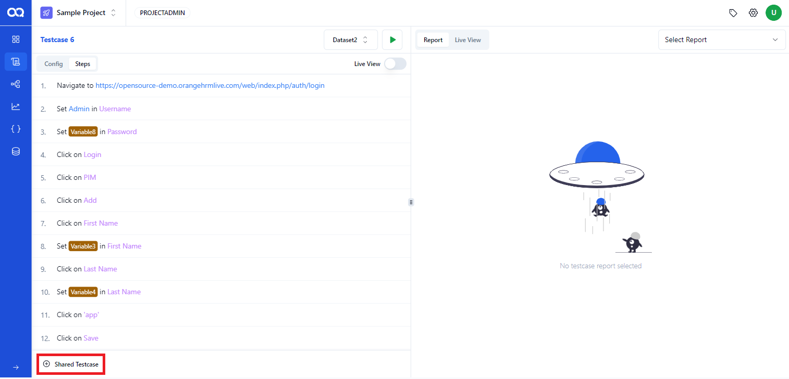
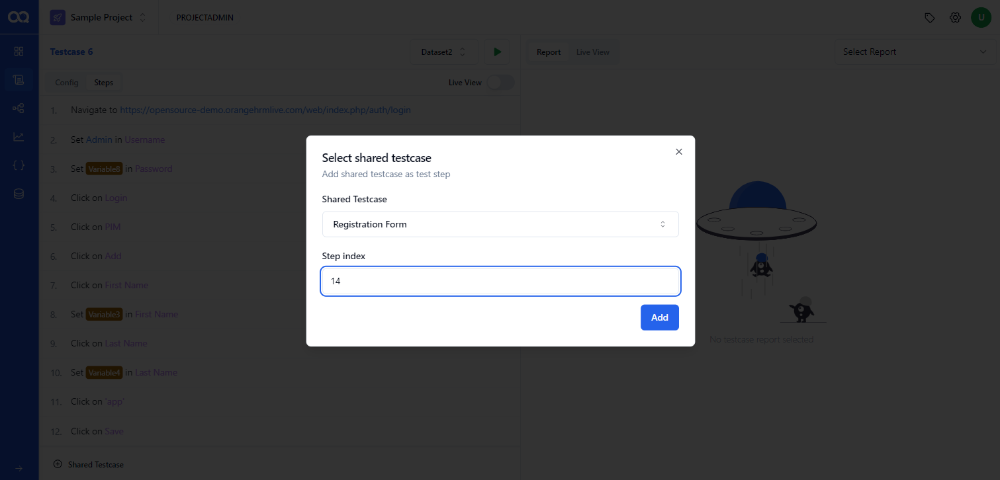
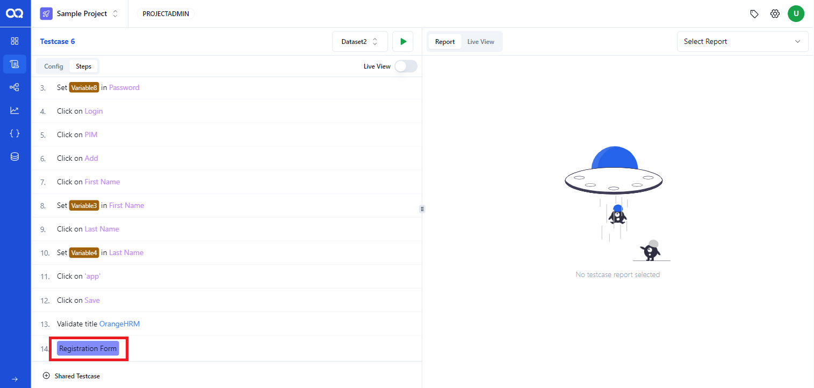
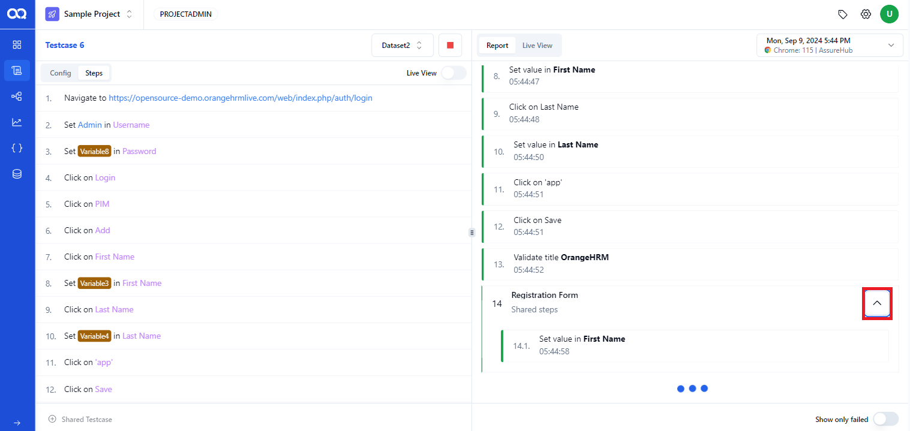

Shared steps allow you to reuse common test steps across multiple test cases, making your testing process more efficient. This guide walks you through adding shared steps to a test case in AssureQA.

## 🛠️ Adding Shared Steps to a Test Case

### Step-by-Step Process

1. **Navigate to the Test Case Page**:
   - Select the test case where you want to add shared steps. On the test case page, locate the **Shared Test Case** button at the bottom left.

   

2. **Select the Shared Test Case**:
   - A dialog box will appear. Use the dropdown to select the shared test case you want to insert. You can also specify the **Step Index** to define where in the test case the shared step should appear.

   

3. **Add the Shared Step**:
   - Click the **Add** button to insert the shared step at the specified index within the test case.

   

---

## 🔄 Running the Test Case with Shared Steps

After adding the shared steps, you can execute the test case:

1. **Run the Test Case**:
   - Click on the **Run** button to start the test case. You can monitor the execution and view the **Live Report** for the shared steps.

   

---

