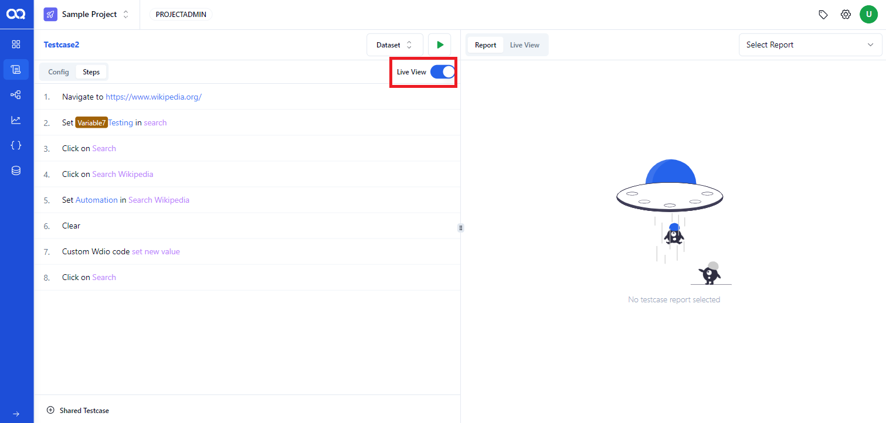

Ready to run your test cases in AssureQA? Follow these steps to execute them smoothly.

## 🛠️ Step 1: Setting Up Your Test Configuration

Before running a test, configure the necessary settings to match your testing requirements.

### 🌐 Test Configuration Options

1. **Access Test Config**:  
   Start by navigating to your test case and clicking on the *"Config"*. Here you can select the desired browser and environment.

   .png)

2. **Advanced Settings**:  
   Dive into advanced settings like adaptive wait , screenshot capture preferences, and screen resolution setup.

3. **Selecting Screenshots**:  
   Decide if you want screenshots to be taken at all steps or only specific ones. Toggle the option as per your need.

### ⚙️ Step-by-Step Execution

1. **Executing the Test Case**:  
   Click on the test step to reveal specific options. Adjust settings according to the action needed.

   .png)

2. **Input Definitions and Set Conditions**:  
   In this instance, "SETTEXT" has been chosen, offering options such as "Definition" allowing the user to input plain text and incorporate variables and built-in functions as needed.

.png)

Following this, the element name is identified, and users can set it according to their preferences until it is utilized for the scripting healing.

Moving forward, there are locators that can be edited or added based on user requirements

3. **Save and Run**:
   After setting up your test steps, save the configuration and start the test run. Monitor the process and make adjustments as needed.

---

## 🚦 Managing Errors and Conditions

### Error Handling

1. **Choose Error Conditions**:  
   Set up how the system handles errors during the test:
   - **Mark error and stop**: The test stops at the error.
   - **Mark error and continue**: The test marks the error but continues.
   - **Mark warning and continue**: Only a warning is issued, and the test continues.

   .png)

2. **Live Monitoring**:  
   Enable live view toggle button to view test execution in real-time, enhancing your control over the testing process.

   

---

Now, you're equipped to run and manage test cases efficiently with AssureQA! Keep exploring the settings to optimize your testing process. 🌟
