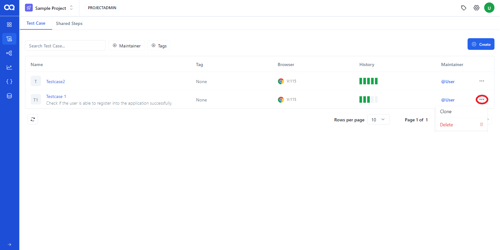
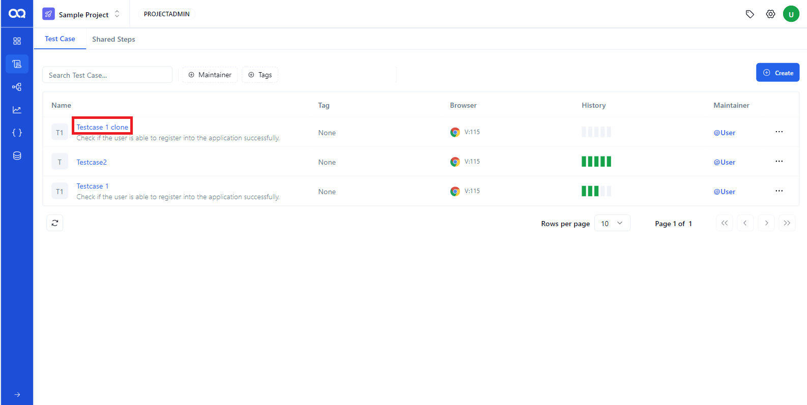
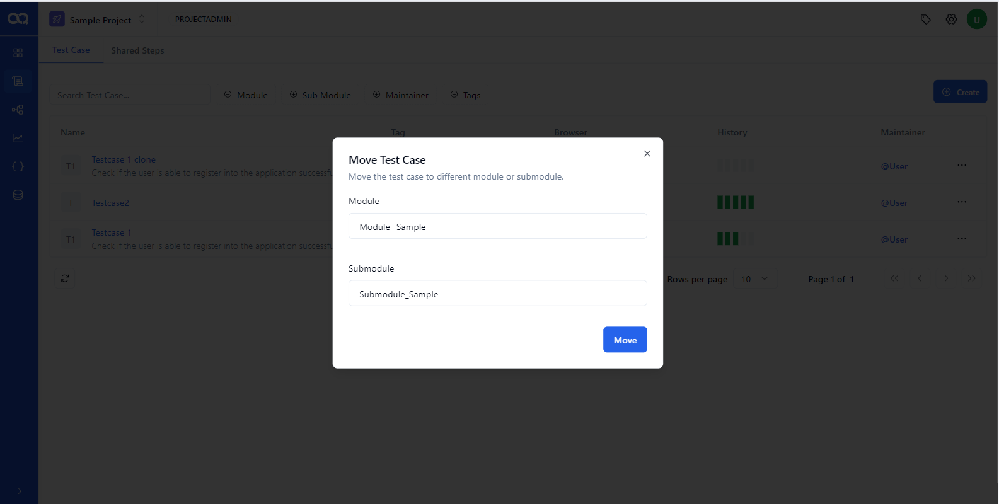
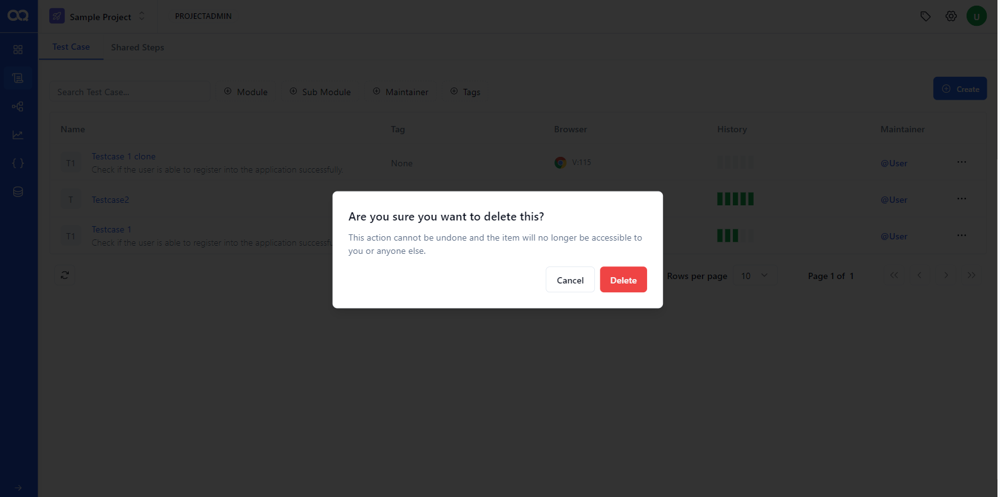
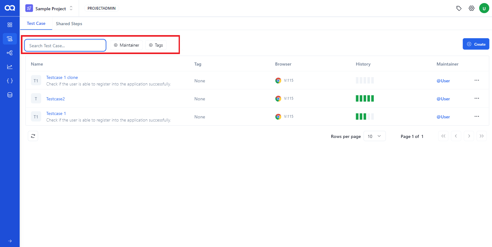
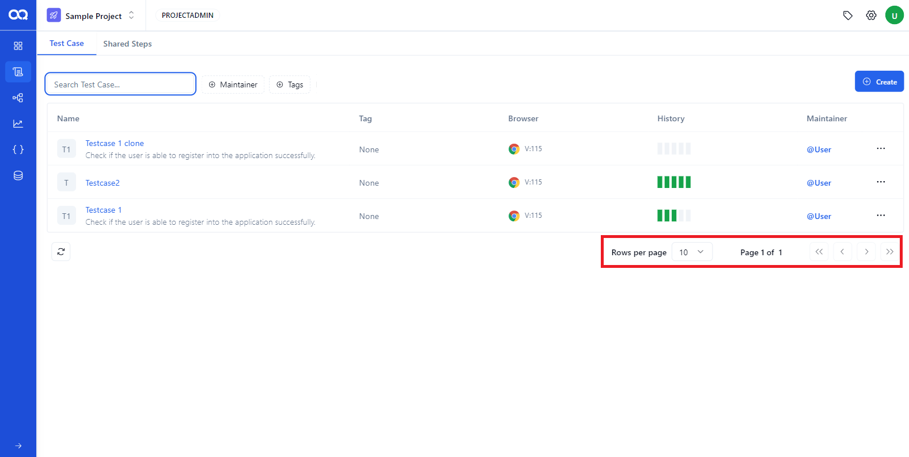

Understanding how to navigate and manage your test cases on the Test Case Page will enhance your efficiency and productivity in AssureQA.

## 🛠️ Overview of the Test Case Page

The Test Case Page is where all your test cases are displayed. It's designed to provide quick access to various management options.

### 📊 Test Case Management

1. **Clone and Delete**:  
   Use the options icon on the right of each test case to clone or delete a test case.

   

2. **Cloning a Test Case**:  
   Easily duplicate a test case for different testing scenarios.

   

3. **Moving a Test Case**:  
   Relocate a test case to another module or sub-module as needed.

   

4. **Deleting a Test Case**:  
   Remove a test case permanently if no longer needed.

   

---

## 🔍 Filtering and Searching

### Finding the Right Test Case

1. **Applying Filters**:  
   Narrow down your search by using filters based on maintainers or tags.

   

2. **Searching by Name**:  
   Quickly find a test case by typing its name in the search field.

3. **Resetting Filters**:  
   Reset all filters to start a fresh search with just one click.

---

## 🧭 Navigation Tips

Navigate seamlessly through the Test Case Page to access different functionalities efficiently.

Now, you're all set to effectively manage and navigate through your test cases on the Test Case Page in AssureQA! 🎉 Explore and make the most out of these functionalities to streamline your testing workflow.
