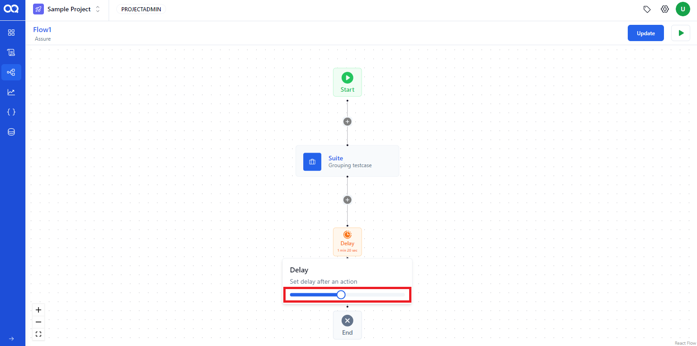

Enhance your test flows in AssureQA by incorporating multiple nodes to simulate complex testing scenarios. This guide will help you understand how to effectively use different nodes like suite, delay, condition, and email within a flow.

## 🛠️ Building a Multi-Node Flow

### Step-by-Step Node Integration

1. **Starting with a Suite Node**:
   Begin your flow by creating a suite node where you can specify test case details, browser settings, environment, and version.

   

2. **Adding Test Cases**:
   Fill in the necessary fields and add the test cases to the suite node.

   

3. **Incorporating a Delay Node**:
   Click the plus button and select the delay node from the dropdown list to introduce wait times in your flow.

   

   Adjust the delay duration using the slider on the node, which will display the set time.

   

4. **Setting up a Condition Node**:
   Add a condition node to dictate the flow’s direction based on the outcomes of the preceding suite node.

   

   This node will determine the path of the flow—proceeding to "Passed" if the suite succeeds, or to "Failed" if it does not.

> [!Note]
> Ensure that a suite node is added before integrating a condition node as it relies on the suite’s results.

   

5. **Adding an Email Node**:
   Choose the email option from the action dropdown menu to set up notifications or reports to be sent upon flow execution.

   

   Configure the mail node by selecting recipients and update the flow to integrate this notification feature.

   
   

---

With these steps, your test flow will not only execute tests but also manage conditional paths and send notifications based on test outcomes, making your testing process robust and responsive. 🌟 Dive into setting up these multi-node configurations to maximize the efficiency of your testing strategy in AssureQA!
