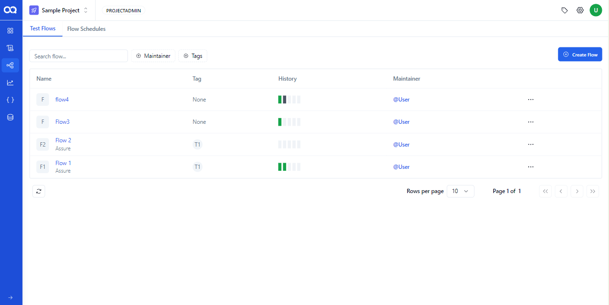
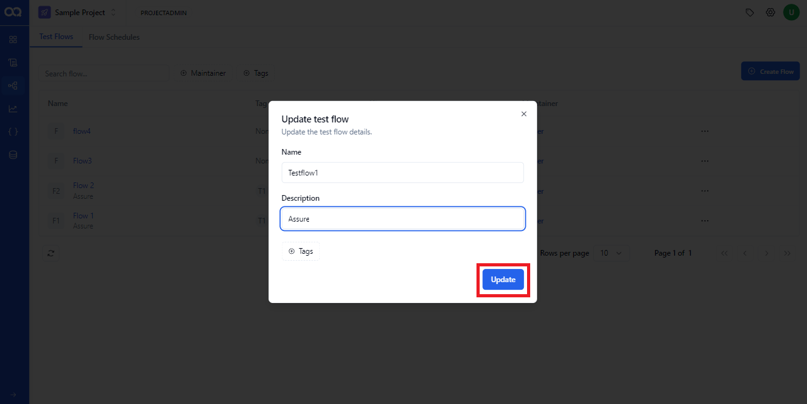
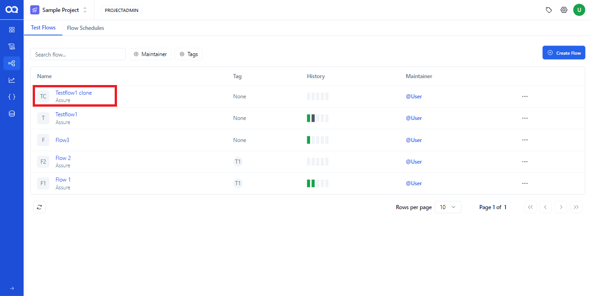
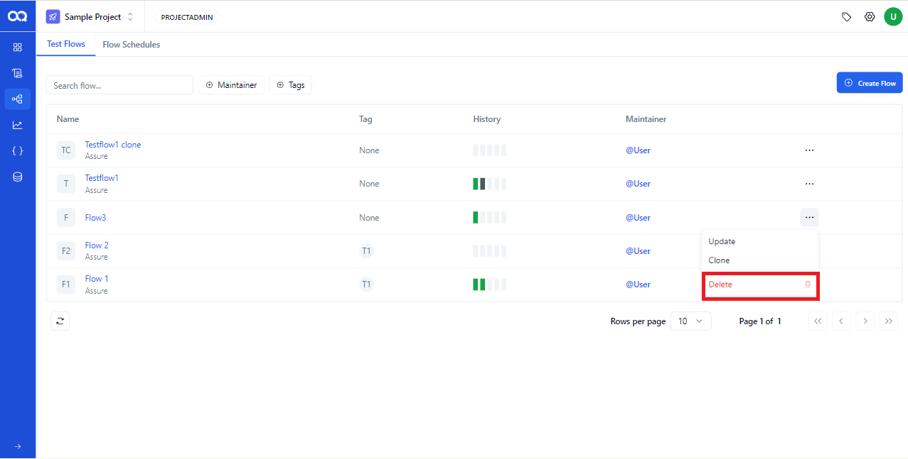
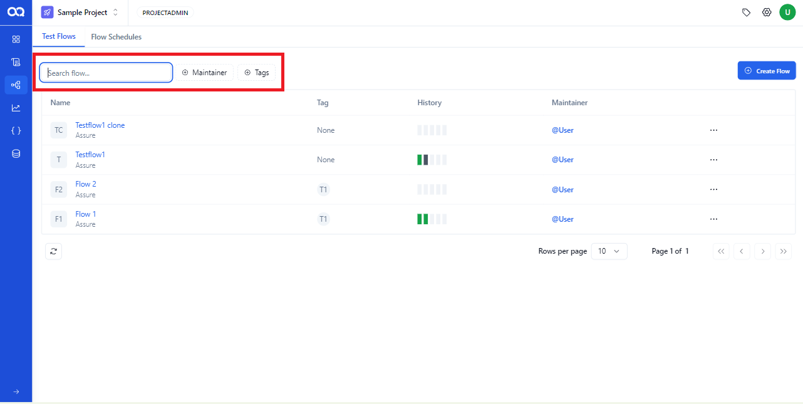

The Test Flow page in AssureQA serves as your control center for managing and overseeing all test flows. Here's how you can effectively utilize this page to streamline your testing process.

## 🛠️ Navigating the Test Flow Page

The page displays all the flows you've created, complete with details like the flow name, maintainer, and tags.

### 🔄 Flow Management Options

Manage your flows directly from this page using simple but powerful tools:

1. **Update a Flow**:  
   Edit the flow’s details such as name, description, and tags. Save changes by clicking the *"Update"* button.

   

2. **Clone a Flow**:  
   Duplicate any selected flow to reuse configurations or as a template for a new test scenario.

   

3. **Delete a Flow**:  
   Remove a flow when it's no longer needed. Click on the three dots, select "Delete," and confirm in the warning message to proceed.

   

---

## 🔍 Filtering and Searching

Efficiently find the flows you need with robust filtering options:

1. **Using Filters**:  
   Apply filters based on the flow’s maintainer or tags to quickly locate specific flows.

2. **Search by Name**:  
   Enter a flow name in the search field to bring it up instantly.

3. **Reset Filters**:  
   Clear all filters at once by clicking the *"Reset"* button, giving you a fresh start to search again.

---

With these tools and tips, you're all set to manage your test flows efficiently on the Test Flow Page in AssureQA! 

🎉 Explore and customize your flows to fit your testing needs perfectly.
