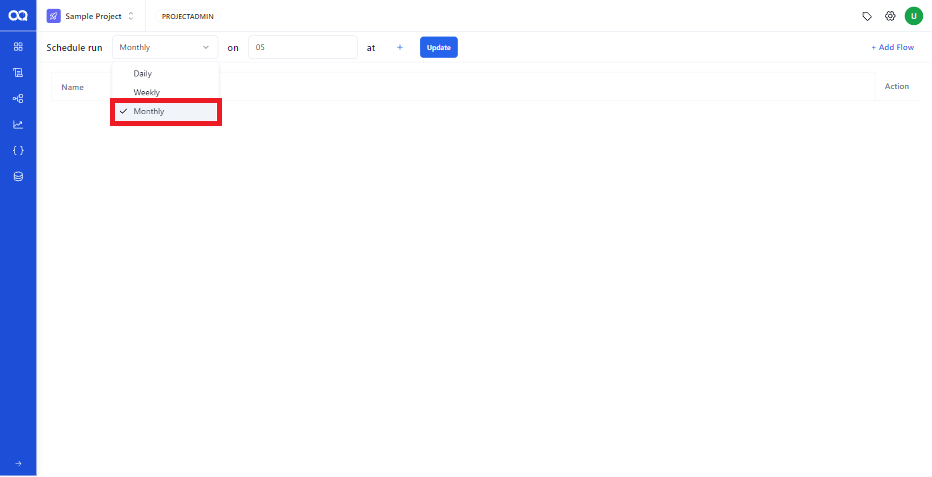
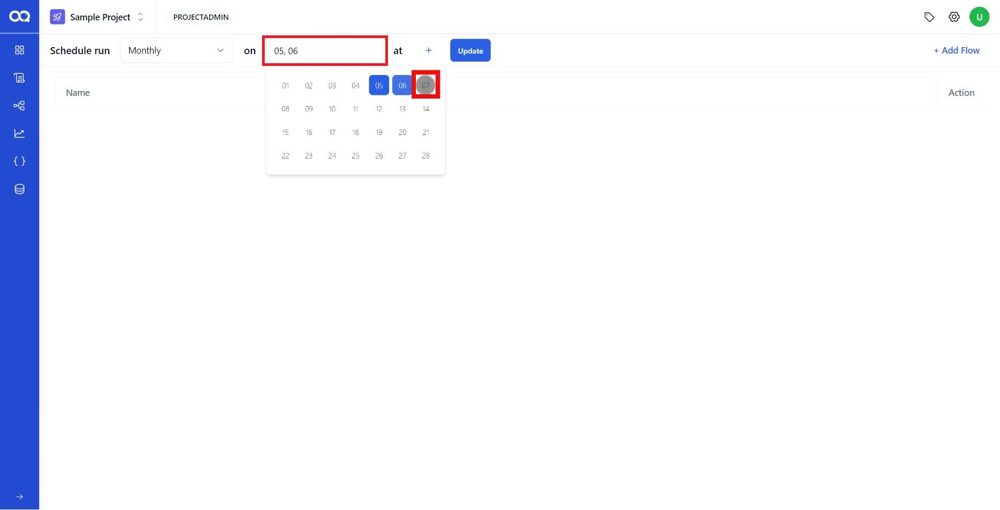
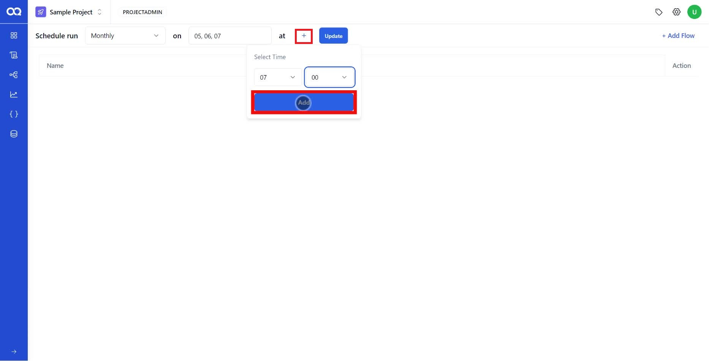
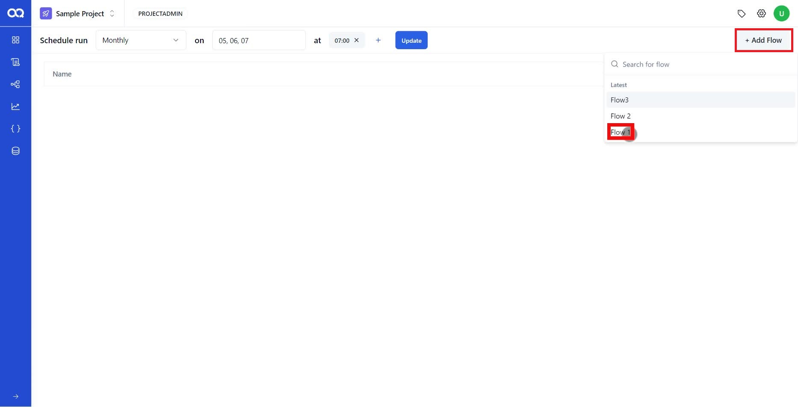
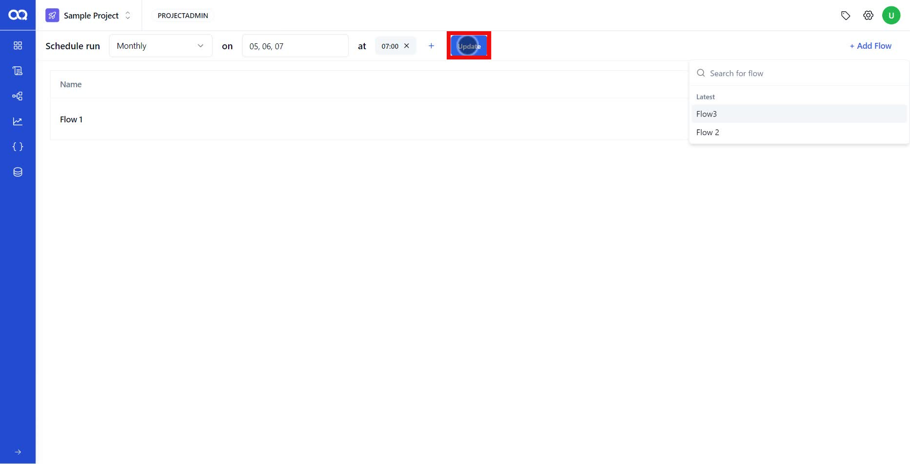

Monthly schedules in AssureQA allow you to automate test flows on specific days of the month, ensuring timely execution of your test plans. This guide will walk you through the process step-by-step.

## 🛠️ Creating Monthly Schedules

### Step-by-Step Setup

1. **Select Monthly Frequency**:
   - In the schedule creation page, choose **Monthly** from the dropdown to set up a monthly flow schedule.

   

2. **Select Days of the Month**:
   - From the dropdown, select the days of the month when you want the flow to run. You can select multiple days if needed.

   
   
> [!TIP]  
> The same flow can be scheduled to run on multiple days within a month for better coverage and flexibility.

3. **Set Time for Execution**:
   - Click the **'+'** button to add specific times for the flow to execute on the selected days.

   

4. **Add Flow to Schedule**:
   - Click the **Add Flow** button to select the flow you want to schedule for the chosen days and times.

   

5. **Finalize the Schedule**:
   - Once the details are confirmed, click **Update** to save your schedule.

   

---

Once you click the **Update** button, your scheduled flow will automatically execute on the specified days of the month at the designated times, as long as the schedule is active. This allows you to automate key testing processes over specific intervals.

